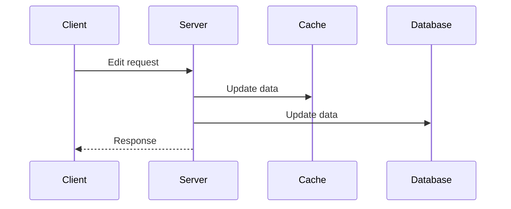
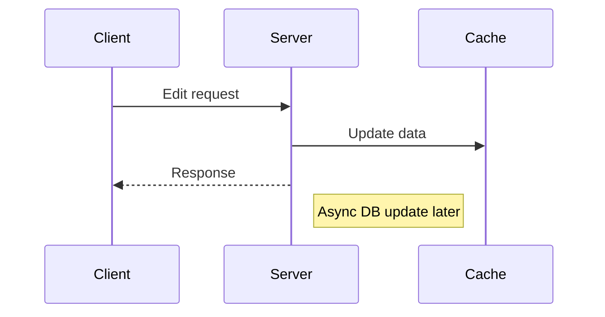

# **Caching in System Design - Comprehensive Guide**

## **1. Caching Fundamentals**
- **Definition:** Storing data copies in faster-access locations than primary storage
- **Core Purpose:** Reduce data retrieval time and system load
- **Key Benefit:** Dramatically improves system performance and scalability

## **2. Caching Architecture Levels**

### **A. Client-Side Caching**
- **Location:** Browser or client device
- **Examples:** 
  - Browser cache (HTTP caching headers)
  - Mobile app local storage
- **Advantages:**
  - Eliminates network calls for repeated requests
  - Fastest possible response time

### **B. Server-Side Caching**
- **Location:** Application server memory
- **Implementation:** 
  - In-memory data stores (Redis, Memcached)
  - Application-level caching
- **Advantages:**
  - Reduces database queries
  - Maintains frequently accessed data in fast memory

### **C. Distributed Caching**
- **Location:** Between servers and database
- **Implementation:**
  - Dedicated cache servers
  - CDN edge caching
- **Advantages:**
  - Shared cache across multiple servers
  - Reduces load on primary database

## **3. Key Use Cases for Caching**

### **A. Network Call Optimization**
- **Problem:** High-latency database queries
- **Solution:** Cache query results to avoid repeated network hops
- **Example:** User profile data that rarely changes

### **B. Computational Optimization**
- **Problem:** Expensive calculations or processing
- **Solution:** Cache computation results
- **Example:** Machine learning model inferences

### **C. Hotspot Prevention**
- **Problem:** Millions requesting same data (celebrity profile)
- **Solution:** Cache popular content to avoid database overload
- **Example:** Viral social media posts

## **4. Cache Write Strategies**

### **A. Write-Through Cache**

- **Behavior:** Synchronous write to both cache and database
- **Pros:**
  - Strong consistency
  - No stale data
- **Cons:**
  - Higher write latency
  - Doesn't reduce database write load

### **B. Write-Back Cache**

- **Behavior:** Immediate cache update + async database write
- **Pros:**
  - Faster write responses
  - Reduces database write load
- **Cons:**
  - Temporary inconsistency
  - Risk of data loss if cache fails

## **5. Cache Invalidation Patterns**

| Pattern | Description | Use Case |
|---------|-------------|----------|
| **TTL** | Automatic expiration after set time | Time-sensitive data |
| **LRU** | Evicts least recently used items | Memory-constrained systems |
| **Write-Invalidate** | Invalidates on write operations | Strong consistency needs |
| **Manual** | Explicit cache purge | Critical data changes |

## **6. Advanced Considerations**

### **Cache Stampede Protection**
- Techniques to prevent thundering herd problem:
  - Locking mechanisms
  - Background refresh
  - Probabilistic early expiration

### **Distributed Cache Consistency**
- Challenges in multi-server environments:
  - Cache coherence protocols
  - Eventual consistency models
  - Version vector techniques

### **Cache Monitoring Essentials**
- Key metrics to track:
  - Hit/miss ratio
  - Eviction rates
  - Memory usage
  - Latency improvements

## **7. Implementation Recommendations**

1. **Start Simple:** Begin with basic in-memory caching
2. **Layer Caches:** Combine client, server, and CDN caching
3. **Measure First:** Profile to identify hottest data
4. **Gradual Complexity:** Add write strategies as needed
5. **Monitor Rigorously:** Watch for stale data and memory pressure

## **8. Key Takeaways**

6. Caching exists at **multiple levels** in system architecture
7. Three primary benefits: **speed**, **compute savings**, and **load reduction**
8. **Write strategies** involve important consistency-performance tradeoffs
9. **Invalidation** is often more challenging than caching itself
10. Modern systems often employ **multiple caching strategies** simultaneously

**Next Steps:**
- Explore Redis/Memcached deep dives
- Study cache consistency models
- Learn about CDN caching strategies
- Investigate cache partitioning techniques