### **Class Relationships (Concepts)**
Here’s an example in Java that demonstrates all the relationships you’ve mentioned:
#### Basics
##### 1. Interface
###### Diagram
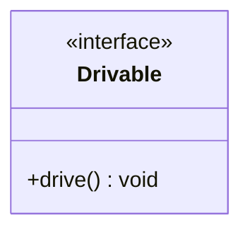
An interface defines a contract that classes can implement.
```java
interface Drivable {
    void drive();
}
```

##### 2. Abstract Class
An abstract class provides a partial implementation and can have abstract methods.
```java
abstract class Vehicle {
    abstract void start();
    void stop() {
        System.out.println("Vehicle stopped.");
    }
}
```
###### Diagram
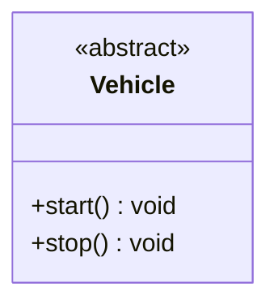
##### 3. Class
A class is a blueprint for creating objects.
`Car`, `Bike`, `ElectricCar`, etc., are concrete classes.
```java
class Car extends Vehicle implements Drivable {
    @Override
    void start() {
        System.out.println("Car started.");
    }

    @Override
    public void drive() {
        System.out.println("Car is being driven.");
    }
}
```
###### Diagram
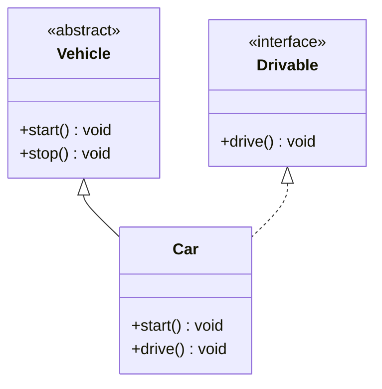

#### OOPS
##### 4. Generalization: A implements B
A class implements an interface.
```java
class Bike implements Drivable {
    @Override
    public void drive() {
        System.out.println("Bike is being driven.");
    }
}
```
###### Diagram
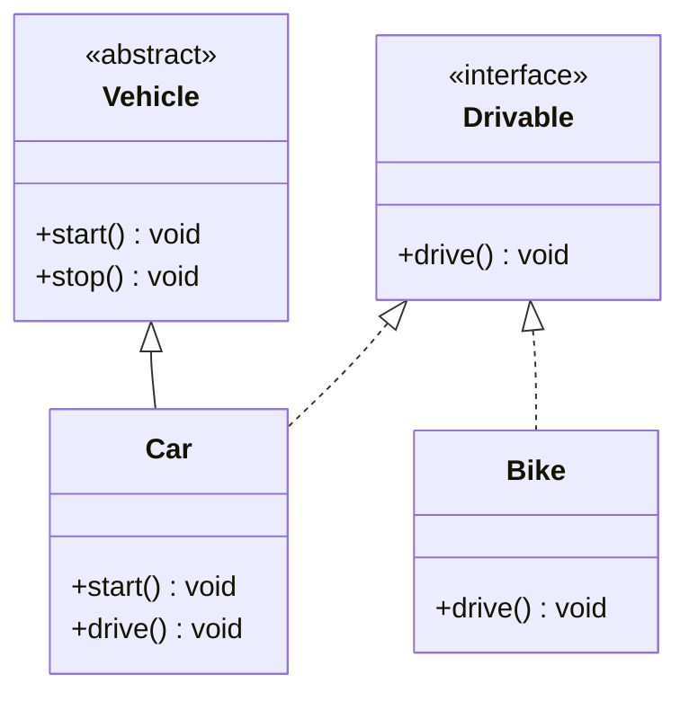
##### 5. Inheritance: A inherits from B. A "is-a" B.
A class inherits from another class.
```java
class ElectricCar extends Car {
    void charge() {
        System.out.println("Electric car is charging.");
    }
}
```
###### Diagram
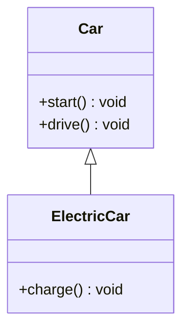
#### Types of Associations
##### 6. **Use Interface: A uses interface B.**

A class uses an interface as a dependency.
```java
class Driver {
    private Drivable vehicle;

    Driver(Drivable vehicle) {
        this.vehicle = vehicle;
    }

    void operateVehicle() {
        vehicle.drive();
    }
}
```
###### Diagram
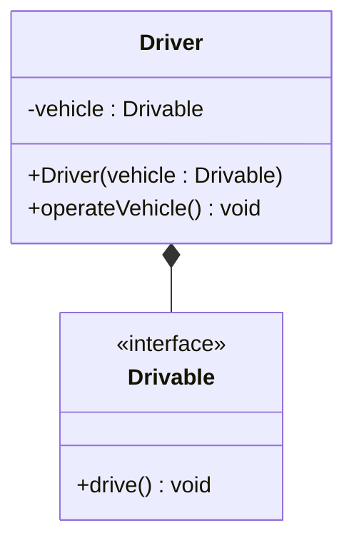
##### 7. **Association: A and B call each other.**

Two classes are associated and can interact with each other.
```java
class Engine {
    void start() {
        System.out.println("Engine started.");
    }
}

class CarWithEngine {
    private Engine engine;

    CarWithEngine(Engine engine) {
        this.engine = engine;
    }

    void startCar() {
        engine.start();
        System.out.println("Car started.");
    }
}
```
###### Diagram
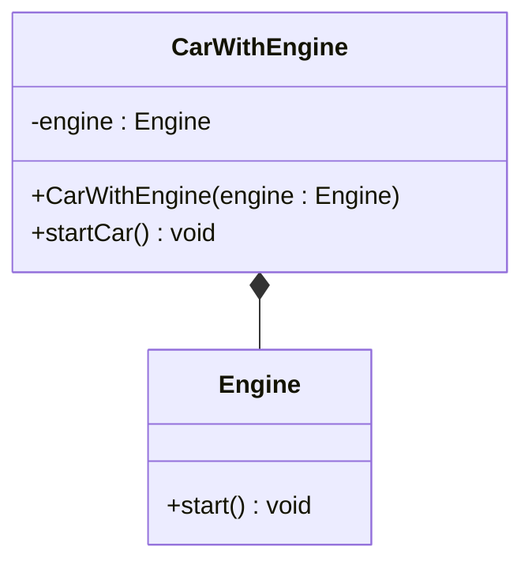
##### 8. **Uni-directional Association: A can call B, but not vice versa.**
One class knows about and uses another class, but not the other way around.
```java
class Radio {
    void playMusic() {
        System.out.println("Music is playing.");
    }
}

class CarWithRadio {
    private Radio radio;

    CarWithRadio(Radio radio) {
        this.radio = radio;
    }

    void playCarMusic() {
        radio.playMusic();
    }
}
```
###### Diagram
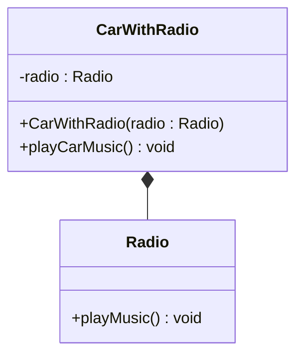
##### 9. **Aggregation: A "has-an" instance of B. B can exist without A.**

A class contains another class, but the contained class can exist independently.
```java
class Wheel {
    private String type;

    Wheel(String type) {
        this.type = type;
    }

    void rotate() {
        System.out.println("Wheel is rotating.");
    }
}

class CarWithWheels {
    private Wheel[] wheels;

    CarWithWheels(Wheel[] wheels) {
        this.wheels = wheels;
    }

    void move() {
        for (Wheel wheel : wheels) {
            wheel.rotate();
        }
        System.out.println("Car is moving.");
    }
}
```
###### Diagram
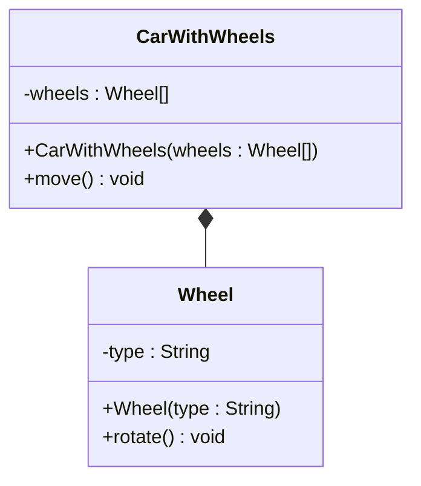
##### 10. **Composition: A "has-an" instance of B. B cannot exist without A.**

A class contains another class, and the contained class cannot exist independently.

```java
class Engine {
    void start() {
        System.out.println("Engine started.");
    }
}

class CarWithComposition {
    private Engine engine;

    CarWithComposition() {
        this.engine = new Engine(); // Engine is created when Car is created.
    }

    void startCar() {
        engine.start();
        System.out.println("Car started.");
    }
}
```
###### Diagram
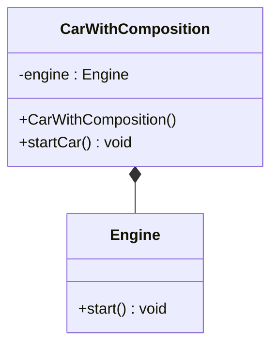
#### Driver Code
```java
public class Main {
    public static void main(String[] args) {
        // Generalization and Inheritance
        Car car = new Car();
        car.start();
        car.drive();

        ElectricCar electricCar = new ElectricCar();
        electricCar.start();
        electricCar.drive();
        electricCar.charge();

        // Use Interface
        Driver driver = new Driver(car);
        driver.operateVehicle();

        // Association
        Engine engine = new Engine();
        CarWithEngine carWithEngine = new CarWithEngine(engine);
        carWithEngine.startCar();

        // Uni-directional Association
        Radio radio = new Radio();
        CarWithRadio carWithRadio = new CarWithRadio(radio);
        carWithRadio.playCarMusic();

        // Aggregation
        Wheel[] wheels = {new Wheel("Front Left"), new Wheel("Front Right"), new Wheel("Rear Left"), new Wheel("Rear Right")};
        CarWithWheels carWithWheels = new CarWithWheels(wheels);
        carWithWheels.move();

        // Composition
        CarWithComposition carWithComposition = new CarWithComposition();
        carWithComposition.startCar();
    }
}
```
#### **7. Association (Bi-directional)**

In a **bi-directional Association**, both classes know about each other and can interact.
```java
class Person {
    private String name;
    private Address address;

    Person(String name, Address address) {
        this.name = name;
        this.address = address;
    }

    void display() {
        System.out.println("Person: " + name);
        address.display();
    }
}

class Address {
    private String city;
    private Person person;

    Address(String city) {
        this.city = city;
    }

    void setPerson(Person person) {
        this.person = person;
    }

    void display() {
        System.out.println("Address: " + city);
        if (person != null) {
            System.out.println("Person living here: " + person.getName());
        }
    }
}
```
###### Diagram
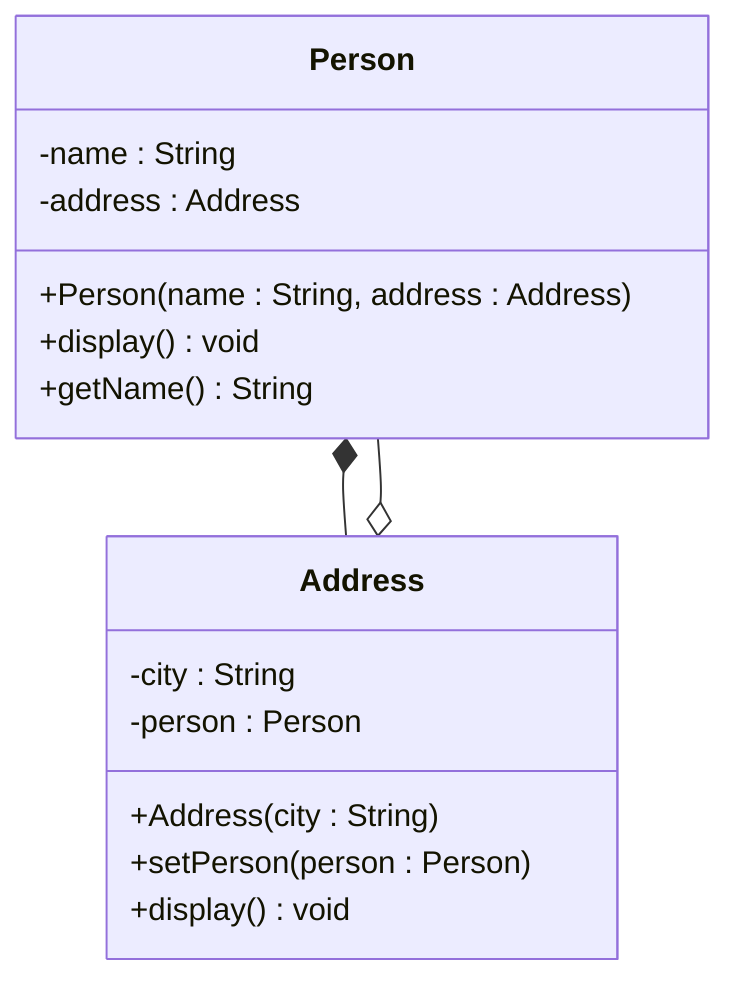
Here:
- `Person` has a reference to `Address`.
- `Address` also has a reference to `Person`.
- Both classes can call methods on each other.
#### **8. Uni-directional Association**

In **Uni-directional Association**, one class knows about the other, but the other class does not know about the first one. This is a one-way relationship.

```java
class Radio {
    void playMusic() {
        System.out.println("Music is playing.");
    }
}

class CarWithRadio {
    private Radio radio;

    CarWithRadio(Radio radio) {
        this.radio = radio;
    }

    void playCarMusic() {
        radio.playMusic();
    }
}
```
Here:
- `CarWithRadio` has a reference to `Radio`.
- `CarWithRadio` can call methods on `Radio`.
- `Radio` does not have a reference to `CarWithRadio`.
###### Diagram
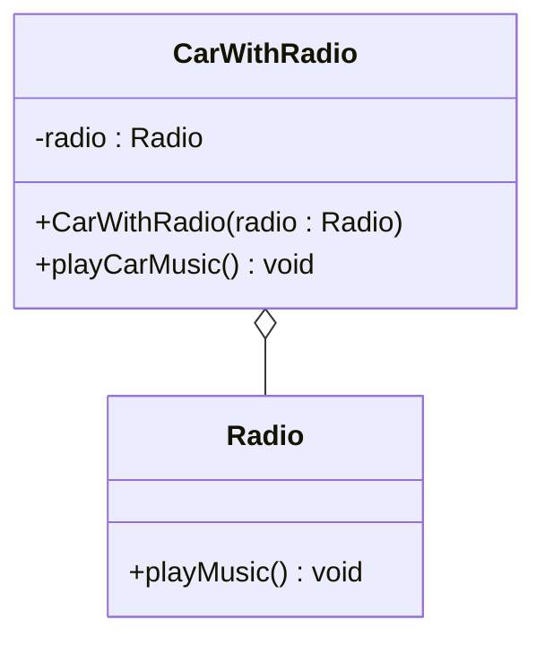
#### Updated Example to Show Both Relationships
```java
public class Main {
    public static void main(String[] args) {
        // Bi-directional Association
        Address address = new Address("New York");
        Person person = new Person("John", address);
        address.setPerson(person); // Establishing bi-directional relationship
        person.display();

        // Uni-directional Association
        Radio radio = new Radio();
        CarWithRadio carWithRadio = new CarWithRadio(radio);
        carWithRadio.playCarMusic();
    }
}
```
###### Diagram
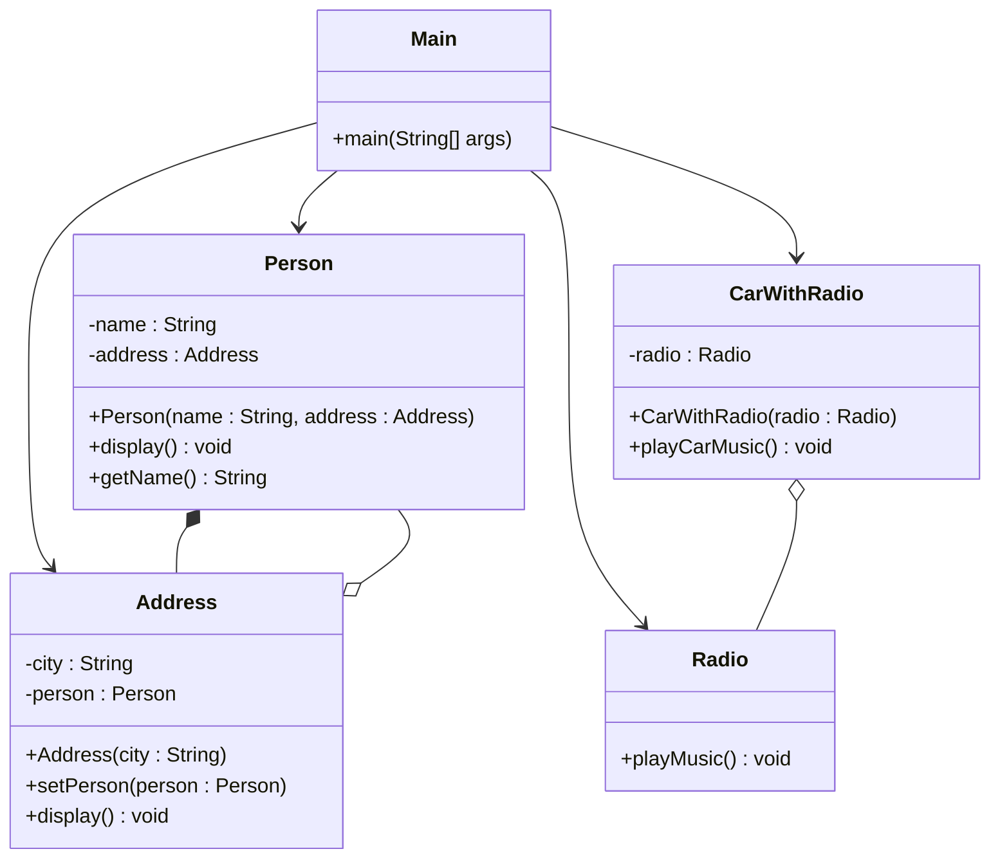

#### Output:

```java
Person: John
Address: New York
Person living here: John
Music is playing.
```
### **Designs Observed**
#### 1. Rewriting a primitive field to Class
```java
// primitive simplest Form
String name = "random";

// Extending Primitive to Simple class
public class User{
	String name;
}
```

#### 2. Rewriting primitive field to an Enum
```java
// if a field has only suitable values
// simplest form
String accountStatus = "Active" // "Active", "Pending", "Cancelled", "Deactived"

public Enum AccountStatus {
	ACTIVE,
	PENDING,
	CANCELLED,
	DEACTIVATED
} 
```

#### 2b. Rewriting a function to Class Method
```java
public boolean bookCheckout(Book book, User user){
	// implement logic
	return true;
}


// Move this func to class Block
class Functionalities {
	public boolean bookCheckout(Book book, User user){ // can be static method
		// implement logic
		return true;
	}
}
```
#### 3. Enhancing Class of primitives to a Class of Association
```java
public class User{
	String name;
	String Address
}

// Scaling class by adding a Association (Aggregation/Composition)
public class User {
	String name;
	Address address;
}
public class Address {
	String place;
	int pincode;
}
```

#### 4. Enhancing Class of primitives to Inherited Class of (Association/Primitives)
```java
// Extending Primitive to Simple class
public class User{
	String name;
}

// Scaling class by adding a Association (Aggregation/Composition)
public class Admin extends User {
	String id;
	Address address;
	// Add behaviours if needed.
}

public class Address {
	String place;
	int pincode;
}
```

#### 5. Enhancing Class fields using Encapsulation.
```java
// simplest form
public class User {
	int id;
	String name;
}

// After Encapsulation getters & setters
public class User {
	// 1. Fields are private
	- int id;
	- String name;

	// 2. Adding getters & setters (plain without logic)
	// 2a. for Ids
	+ int getId(){
		return this.id;	
	}
	+ void setId(int id){
		this.id = id;	
	}

	// 2b. for Names
	+ int getName(){
		return this.name;	
	}
	+ void setName(Name name){
		this.name = name;	
	}
}
```

#### 6. Removing a method outside the class
```java
public class Book {
	String id;
	String title;

	+ boolean checkOut(User user){
		//use this & User object to get checkout conditions
	}
}

//Removing boolean checkOut(User)

public class Book{
	String id;
	String title;
}

public class Operations{
	boolean checkOut(Book book, User user){
		//use Book & User instance 
	}
}
```