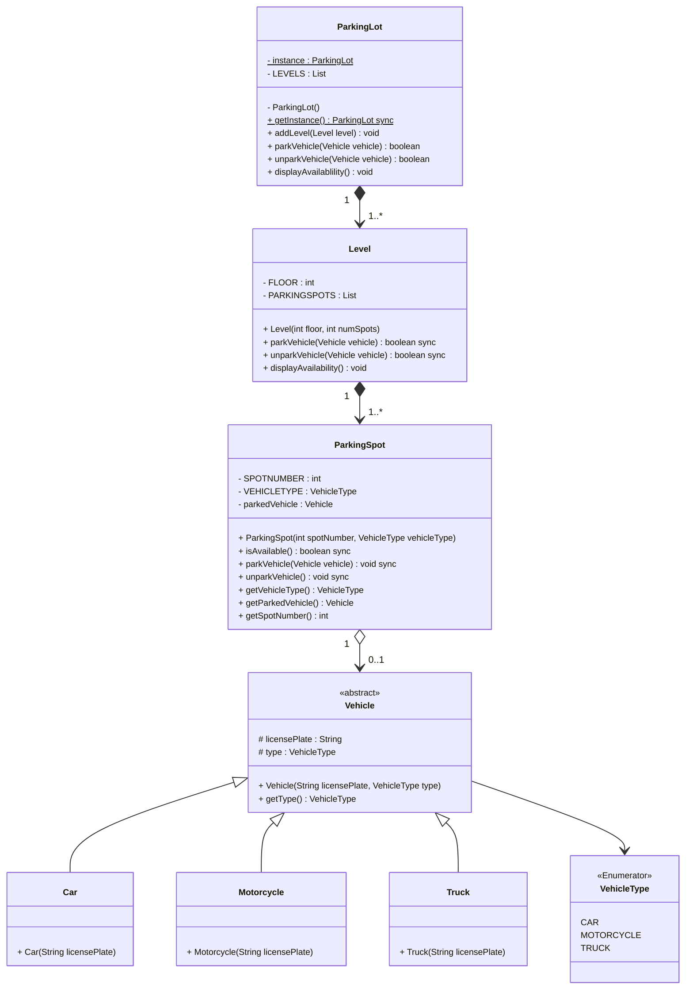

```java
// Step 1:
// Here is the definition of parking slot & all it's children classes

public enum ParkingSlotType {
	HANDICAPPED,
	COMPACT,
	LARGE,
	MOTORBIKE,
	ELECTRIC
}

public abstract class ParkingSlot {
	private String number;
	private boolean free;
	private Vehicle vehicle;
	private final ParkingSlotType type;

	public boolean IsFree();

	public ParkingSlot(ParkingSlotType type) {
		this.type = type;
	}

	public boolean assignVehicle(Vehicle vehicle) {
		this.vehicle = vehicle;
		free = false;
	}

	public boolean removeVehicle() {
		this.vehicle = null;
		free = true;
	}
}

public class HandicappedSlot extends ParkingSlot {
	public handicappedSlot() {
		super(ParkingSlotType.HANDICAPPED);
	}
}

public class CompactSlot extends ParkingSlot {
	public CompactSlot() {
		super(ParkingSlotType.COMPACT);
	}
}

public class LargeSlot extends ParkingSlot {
	public LargeSlot() {
		super(ParkingSlotType.LARGE);
	}
}

public class MotorbikeSlot extends ParkingSlot {
	public MotorbikeSlot() {
		super(ParkingSlotType.MOTORBIKE);
	}
}

public class ElectricSlot extends ParkingSlot {
	public ElectricSlot() {
		super(ParkingSlotType.ELECTRIC);
	}
}
```

```java
// step1a:
// Here is the definition for vehicle and all of it's child classes
```

```java
public enum VehicleType {
	CAR,
	TRUCK,
	ELECTRIC,
	VAN,
	MOTORBIKE
}
public abstract class Vehicle {
	private String licenseNumber;
	private final VehicleType type;
	private ParkingTicket ticket;

	public Vehicle(VehicleType type) {
		this.ticket = ticket;
	}

	public void assignTicket(ParkingTicket ticket) {
		this.ticket = ticket;
	}
}

public class Car extends Vehicle {
	public Car() {
		super(VehicleType.CAR);
	}
}

public class Van extends Vehicle {
	public Van(){
		super(VehicleType.VAN);
	}
}

public class Truck extends Vehicle {
	public Truck(){
		super(VehicleType.TRUCK);
	}
}
```

```java
// step2:
public class ParkingFloor {
	private String name;
	private HashMap<String, HandicappedSlot> handicappedSlots;
	private HashMap<String, CompactSlot> compactSlots;
	private HashMap<String, LargeSlot> largeSlots;
	private HashMap<String, MotorbikeSlot> motorbikeSlots;
	private HashMap<String, ElectricSlot> electricSlots;
	private HashMap<String, CustomerInfoPortal> infoPortals;
	private ParkingDisplayBoard displayBoard;

	public ParkingFloor(String name){
		this.name = name;
	}

	//complete the method
	public void addParkingSlot(ParkingSlot slot){
		
		// Based on slotTypes add ParkingSlots 
		switch(slot.getType()){
			case ParkingSlotType.HANDICAPPED:
				handicappedSlots.put(slot.getNumber(), slot);
				break;
			case ParkingSlotType.COMPACT:
				compactSlots.put(slot.getNumber(), slot);
				break;
			case ParkingSlotType.LARGE:
				largeSlots.put(slot.getNumber(), slot);
				break;
			case ParkingSlotType.MOTORBIKE:
				motorbikeSlots.put(slot.getNumber(), slot);
				break;
			case ParkingSlotType.ELECTRIC:
				electricSlots.put(slot.getNumber(), slot);
				break;
			default: println("Wrong parking slot type!");
		}
	
	}

	//complete the method
	public void assignVehicleToSlot(Vehicle vehicle, ParkingSlot slot){
		
		slot.assignVehicle(vehicle);
	
		// based on slotType updateDisplayBoardFor<Slot> will be updated
		switch(slot.getType()) {
			case ParkingSlotType.HANDICAPPED:
				updateDisplayBoardForHandicapped(slot);
				break;
			case ParkingSlotType.COMPACT:
				updateDisplayBoardForCompact(slot);
				break;
			case ParkingSlotType.LARGE:
				updateDisplayBoardForLarge(slot);
				break;
			case ParkingSlotType.MOTORBIKE:
				updateDisplayBoardForMotorbike(slot);
				break;
			case ParkingSlotType.ELECTRIC:
				updateDisplayBoardForElectric(slot);
				break;
		}
	}

	//complete the method
	private void updateDisplayBoardForHandicapped(ParkingSlot slot){
		if(this.displayBoard.getHandicappedFreeSlot().getNumb() ==
		 slot.getNumb()) {
			// find another free handicapped parking and assign to displayBoard
			for (String key: handicappedSlots.keySet()) {
				if(handicappedSlots.get(key).isFree()){
					this.displayBoard.setHandicappedFreeSlot(handicappedSlots.get(key));
				}
			}
			this.displayBoard.showEmptySlotNumber();
		}
	}

	//complete the method
	private void updateDisplayBoardForCompact(ParkingSlot slot){
		if(this.displayBoard.getCompactFreeSlot().getNumber() == slot.getNumber())
		{
			// find another free compact parking & assign to displayBoard
			for(String key: compactSlots.keySet()){
				if(compactSlots.get(key).isFree()){
					this.displayBoard.setCompactFreeSlot(compactSlots.get(key));
				}
			}
			this.displayBoard.showEmptySlotNumber();
		}
	} 

	//complete the method
	public void freeSlot(ParkingSlot slot){
		slot.removeVehicle();
		switch(slot.getType()){
			case ParkingSlotType.HANDICAPPED:
				freeelectricSlotCount++;
				break;
			case ParkingSlotType.COMPACT:
				freeCompactSlotCount++;
				break;
			case ParkingSlotType.LARGE:
				freeLargeSlotCount++;
				break;
			case ParkingSlotType.MOTORBIKE:
				freeMotorbikeSlotCount++;
				break;
			case ParkingSlotType.ELECTRIC:
				freeelectricSlotCount++;
				break;
			default:
				println("Wrong parking slot type!");
		}
	}
}
```

```java
public class ParkingDisplayBoard{
	private String id;
	private HandicappedSlot handicappedFreeSlot;
	//compact,large, motorbike, electric
	private CompactSlot compactFreeSlot;
	private LargeSlot largeFreeSlot;
	private MotorBikeSlot motorbikeFreeSlot;
	private ElectricSlot electricFreeSlot;

	// complete the method
	public void showEmptySlotNumber() {
		String message = "";
		
		if(handicappedFreeSlot.isFree()) {
			message += "Free Handicapped: " + handicappedFreeSlot.getNumber();
		} else {
			message += "Handicaped is full\n";
		}

		if(compactFreeSlot.isFree()) {
			message += "Free Compact: " + compactFreeSlot.getNumber();
		} else {
			message += "Compact is full\n";
		}

		if(largeFreeSlot.isFree()) {
			message += "Free Large: " + largeFreeSlot.getNumber();
		} else {
			message += "Large is full\n";
		}

		if(motorbikeFreeSlot.isFree()) {
			message += "Free Motorbike: " + motorbikeFreeSlot.getNumber();
		} else {
			message += "Motorbike is full\n";
		}

		if(electricFreeSlot.isFree()) {
			message += "Free Electric: " + electricFreeSlot.getNumber();
		} else {
			message += "Electric is full\n";
		}

	}
}
```

```java
/**
	Our system wil have only one objectof this class. This can be encorced by using the singleton pattern. in software engineering, the singleton pattern is a software design pattern that restricts the instantiation of a class to one object.
*/

public class ParkingLot {
	private String name;
	private Location address;
	private ParkingRate parkingRate;

	private int compactSlotCount;
	private int largeSlotCount;
	private int motorbikeSlotCount;
	private int electricSlotCount;

	private final int maxCompactCount;
	private final int maxLargeCount;
	private final int maxMotorbikeCount;
	private final int maxElectricCount;

	private HashMap<String, EntrancePanel> entrancePanels;
	private HashMap<String, ExitPanel> exitPanels;
	private HashMap<String, ParkingFloor> parkingFloors;

	// All active parking tickets, identified by their ticketNumber
	private HashMap<String, ParkingTicket> activeTickets;

	/*
	singleTon constructor:
	1. To ensure only one object of parkinglot in the system,
	2. All entrance panels will use this object to create new parking ticket: getNewParkingTicket()
	3. similarly exit panels will also use this object to close parking tickets
	*/
	private static ParkingLot parkingLot = null;

	// private constructor to restrict for singleton instance
	private ParkingLot() {
		/*
		1. initialize variables: read name, address & parking Rate from DB
		2. init: parking floors: read the parking floor map from DB this map should tell how many parking slots are there on each floor. This should also initialize max slot counts too.
		3. init: aprking slot counts by reading all active tickets from DB
		4. init: entrance & exit panels: Read from DB
		*/
	}

	// static method to getInstance()
	public static ParkingLot getInstance(){
		if(parkingLot == null){
			parkingLot = new ParkingLot();
		}
		return parkingLot;
	}

	/*
	1. note that the following method is 'synchronized' to allow multiple entrances
	2. panels to issue a new parking ticket without interfering with each other
	*/
	public synchronized ParkingTicket getNewParkingTicket(Vehicle vehicle) throws ParkingFullException {
		if(this.isFull(vehicle.getType())){
			throw new ParkingFullException();
		}
		ParkingTicket ticket = new ParkingTicket();
		vehicle.assignTicket(ticket);
		ticket.saveInDB();
		// if ticket is successfully saved in DB, we can increment the parking slot count
		this.incrementSlotCount(vehicle.getType());
		this.activeTickets.put(ticket.getTicketNumber(), ticket);
		return ticket;
	}

	public boolean isFull(VehicleType type){}

	private boolean incrementSlotCount(VehicleType type){}

	public boolean isFull(){}

	public void addParkingFloor(ParkingFloor) {}
	public void addEntrancePanel(EntrancePanel entrancePanel) {}
	public void addExitPanel(ExitPanel exitPanel)
}
```


```java
public enum ParkingTicketStatus {
	ACTIVE,
	PAID,
	LOST
}
```

```java
//For simplicity, we are not defining getter & setter functions. The reader can assume that all class attributes are private & accessed through their respective public getter method & modified through public setter.
```

```java
public abstract class Account{
	private String userName;
	private String password;
	private AccountStatus status; //refer below
	private Person person; // refer below

	public boolean resetPassword();
}
public enum AccountStatus {
	ACTIVE,
	BLOCKED,
	BANNED,
	COMPROMIZED,
	ARCHIEVED,
	UNKNOWN
}

//dataTypes
public class Person {
	private String name;
	private Address address;
	private String email;
	private String phone;
}

public class Address {
	private String streetAddress;
	private String city;
	private String state;
	private String zipCode;
	private String country;
}
```

```java
public class Admin extends Account {
	// behaviours
	public bool addParkingFLoor(ParkingFloor floor);
	public bool addParkingSlot(String floorName, ParkingSlot slot);
	public bool addParkingDisplayBoard(String floorName, ParkingDisplayBoard displayBoard);
	public bool addCustomerInfoPanel(String floorName, CustomerInfoPanel infoPanel);

	public bool addEntrancePanel(EntrancePanel entrancePanel);
	public bool addExitPanel(ExitPanel exitPanel);
}

public class ParkingAttendant extends Account {
	public bool processTicket(String TicketNumber);
}
```


## AlgoMaster



```java
public class ParkingLotDemo {
	public static void run() {
		ParkingLot parkingLot = ParkingLot.getInstance();
		parkingLot.addLevel(new Level(1, 100));
		parkingLot.addLevel(new Level(2, 80));

		Vehicle car = new Car("ABC123");
		Vehicle truck = new Truck("XYZ789");
		Vehicle motorcycle = new Motorcycle("M1234");

		// Park vehicles
		parkingLot.parkVehicle(car);
		parkingLot.parkVehicle(truck);
		parkingLot.parkVehicle(motorcycle);

		// Display availability
		parkingLot.displayAvailability();

		// Unpark vehicle
		parkingLot.unparkVehicle(motorcycle);

		// Display updated availability
		parkingLot.displayAvailability();
	}
}
```

```java
/*
	ParkingLot.java
	Level.java
	ParkingSpot.java

	vehicletype/
		VehicleType (E)
		Vehicle.java
		Car.java
		Motorcycle.java
		Truck.java
*/
```