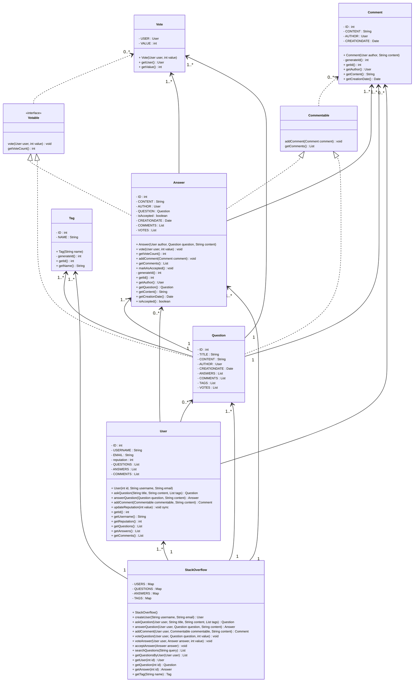

```java
// Account, Member, Admin & Moderator: These classes represetn different people that interact with our system:

public class Account {
	private String id;
	private String password;
	private AccountStatus status;
	private String name;
	private Address address;
	private String email;
	private String phone;
	private int reputation;

	public boolean resetPassword();
}

public enum AccountStatus {
	ACTIVE,
	CLOSED,
	CANCELLED,
	BLACKLISTED,
	BLOCKED
}
```

```java
public class Member {
	private Account account;
	private List<Badge> badges;

	public int getReputation();
	public String getEmail();
	public boolean createQuestion(Question question);
	public boolean createTag(Tag tag);
}

public class Admin extends Member {
	public boolean blockMember(Member member);
	public boolean unblockMember(Member member);
}

public class Moderator extends Member {
	public boolean closeQuestion(Question question);
	public boolean undeleteQuestion(Question question);
}
```

```java
// Badge, Tag & Notification: Members have badges, questions have tags & notifications:

public class Badge {
	private String name;
	private String description;
}

public class Tag {
	private String name;
	private String description;
	private Long dailyAskedFrequency;
	private Long weeklyAskedFrequency;
}

public class Notification {
	private int notificationId;
	private Date createdOn;
	private String content;

	public boolean sendNotification();
}
```

```java
//Photo & Bounty: Members can put bounties on questions. Answers and Questions can have multiple photos

public class Photo {
	private int photoId;
	private String photoPath;
	private Date creationDate;

	private Member creatingMember;

	public boolean delete();
}

public class Bounty {
	private int reputation;
	private Date expiry;

	public boolean modifyReputation(int reputation);
}
```

```java
// Question, Comment & Answer: Members can ask questions, as well as add an answer to any question. All members can add comments to all open questions or answers:
public enum QuestionStatus {
	OPEN,
	CLOSED,
	ON_HOLD,
	DELETED
}

public enum QuestionClosingRemark {
	DUPLICATE,
	OFF_TOPIC,
	TOO_BROAD,
	NOT_CONSTRUCTIVE,
	NOT_A_REAL_QUESTION,
	PRIMARILY_OPINION_BASED
}

public interface Search {
	public static List<Question> search(String query);
}

public class Question implements Search {
	private String title;
	private String description;
	private String viewCount;
	private int voteCount;
	private Date creationTime;
	private Date updateTime;
	private QuestionStatus status;
	private QuestionClosingRemark closingRemark;

	private Member askingMember;
	private Bounty bounty;
	private List<Photo> photos;

	private List<Comment> comments;
	private List<Answer> answers;

	public boolean close();
	public boolean undelete();
	public boolean addComment(Comment comment);
	public boolean addBounty(Bounty bounty);

	public static List<Question> search(String query) {
		// return all question containing the string query in their title or description
	}
}

public class Comment {
	private String text;
	private Date creationTime;
	private int flagCount;
	private int voteCount;

	private Member askingMember;

	public boolean incrementVoteCount();
}

public class Answer {
	private String answerText;
	private boolean accepted;
	private int voteCount;
	private int flagCount;
	private Date creationTime;

	private Member creatingMember;
	private List<Photo> photos;

	public boolean incrementVoteCount();
}
```


## Algomaster




```java
public class StackOverflowDemo {
	public static void run() {
		StackOverflow system = new StackOverflow();

		// Create Users
		User alice = system.createUser("Alice", "alice@example.com")
		User bob = system.createUser("Bob", "bob@example.com")
		User charlie = system.createUser("Charlie", "charlie@example.com")

		// Alice asks a question
		Question javaQuestion = system.askQuestion(alice, "What is polymorphism in Java?", "Can someone explain polymorphism in Java with an example?", Arrays.asList("java", "oop"));

		// Bob answers Alice's question
		Answer bobAnswer = system.answerQuestion(bob, javaQuestion, "Polymorphism in Java is the ability of an object to take on many forms...");

		// Charlie comments on the question
		system.addComment(charlie, javaQuestion, "Great question! I'm also interested in learning about this.");

		// Alice comments on Bob's answer
		system.addComment(alice, bobAnswer, "Thanks for the explanation! Could you provide a code example?");

		// Charlie votes on the question & answer
		system.voteQuestion(charlie, javaQuestion, 1); // Upvote
		system.voteAnswer(charlie, bobAnswer, 1);

		// Alice accepts Bob's answer
		system.acceptAnswer(bobAnswer);

		// Bob asks another question
		Question pythonQues = system.askQuestion(bob, "How to use list comprehensions in Python?", "I'm new to Python & I've heard about list comprehensions. Can someone explain how to use them?", Arrays.asList("python", "list-comprehension"));

		// Alice answers Bob's question
		Answer aliceAns = system.answerQuestion(alice, pythonQuestion, "List comprehensions in Python provide a concise way to create lists...");

		// Charlie votes on Bob's question and Alice's answer
		system.voteQuestion(charlie, pythonQuestion, 1); // Upvote
		system.voteAnswer(charlie, aliceAnswer, 1); // Upvote


		// Print out the current state
		println("Question: " + javaQuestion.getTitle());
        println("Asked by: " + javaQuestion.getAuthor().getUsername());
        println("Tags: " + javaQuestion.getTags().stream().map(Tag::getName).reduce((a, b) -> a + ", " + b).orElse(""));
        println("Votes: " + javaQuestion.getVoteCount());
        println("Comments: " + javaQuestion.getComments().size());
        println("\nAnswer by " + bobAnswer.getAuthor().getUsername() + ":");

		println(bobAnswer.getContent());
        println("Votes: " + bobAnswer.getVoteCount());
        println("Accepted: " + bobAnswer.isAccepted());
        println("Comments: " + bobAnswer.getComments().size());

		println("\nUser Reputations:");
        println("Alice: " + alice.getReputation());
        println("Bob: " + bob.getReputation());
        println("Charlie: " + charlie.getReputation());

		// Demonstrate search functionality
        println("\nSearch Results for 'java':");
        List<Question> searchResults = system.searchQuestions("java");
        for (Question q : searchResults) {
            System.out.println(q.getTitle());
        }

		println("\nSearch Results for 'python':");
        searchResults = system.searchQuestions("python");
        for (Question q : searchResults) {
            System.out.println(q.getTitle());
        }

		// Demonstrate getting questions by user
        println("\nBob's Questions:");
        List<Question> bobQuestions = system.getQuestionsByUser(bob);
        for (Question q : bobQuestions) {
            System.out.println(q.getTitle());
        }
	}
}
```

```java
/*
	Answer.java
	Comment.java
	Commentable.java
	Question.java
	StackOverflow.java
	StackOverflowDemo.java
	Tag.java
	User.java
	Votable.java
	Vote.java
*/
```