### **Class Relationships (Concepts)**
Here’s an example in Java that demonstrates all the relationships you’ve mentioned:
#### Basics
##### 1. Interface

An interface defines a contract that classes can implement.
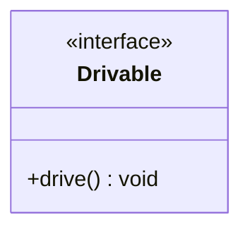

##### 2. Abstract Class
An abstract class provides a partial implementation and can have abstract methods.
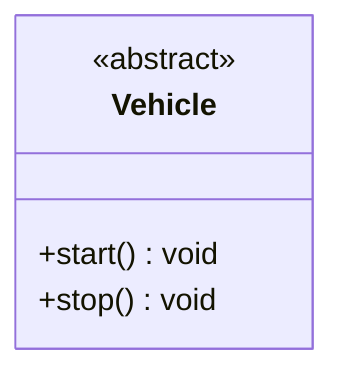
##### 3. Class
A class is a blueprint for creating objects.
`Car`, `Bike`, `ElectricCar`, etc., are concrete classes.
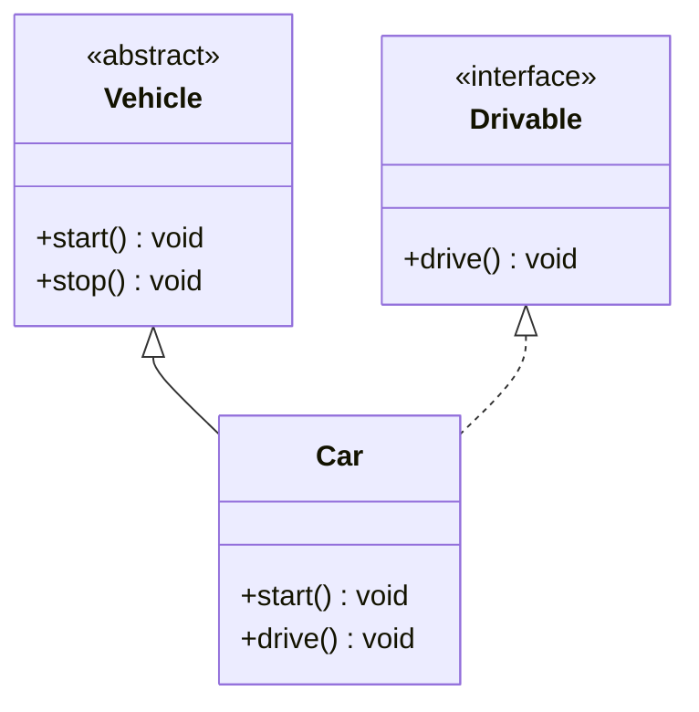
#### OOPS
##### 4. Generalization: A implements B
A class implements an interface.
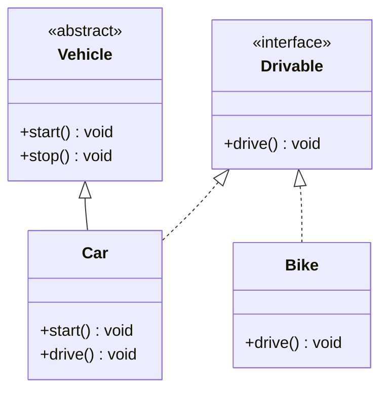
##### 5. Inheritance: A inherits from B. A "is-a" B.
A class inherits from another class.
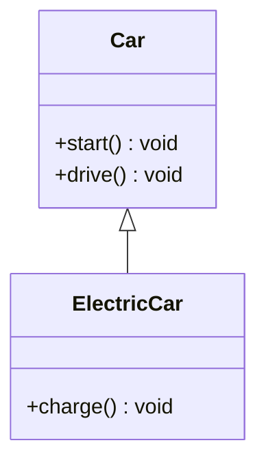
#### Types of Associations
##### 6. **Use Interface: A uses interface B.**

A class uses an interface as a dependency.
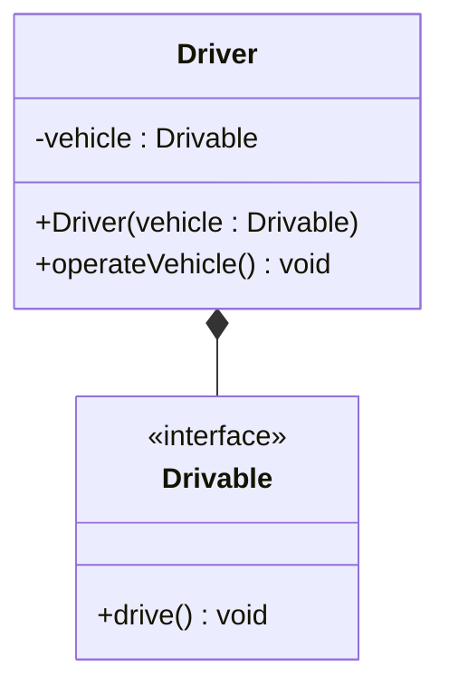
##### 7. **Association: A and B call each other.**

Two classes are associated and can interact with each other.
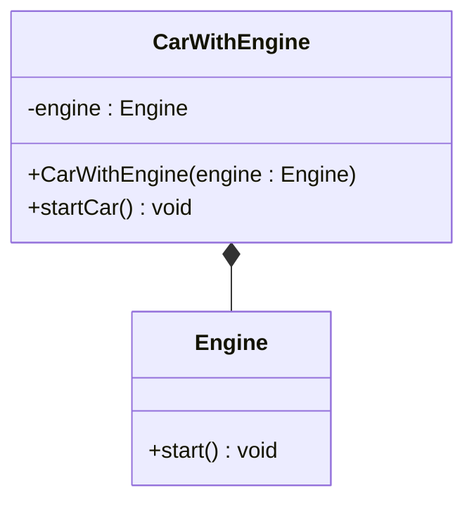
##### 8. **Uni-directional Association: A can call B, but not vice versa.**
One class knows about and uses another class, but not the other way around.
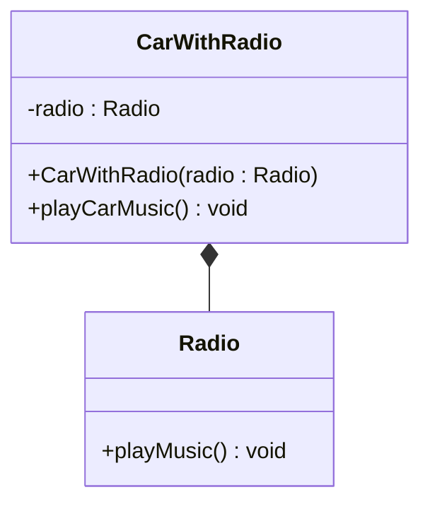
##### 9. **Aggregation: A "has-an" instance of B. B can exist without A.**

A class contains another class, but the contained class can exist independently.
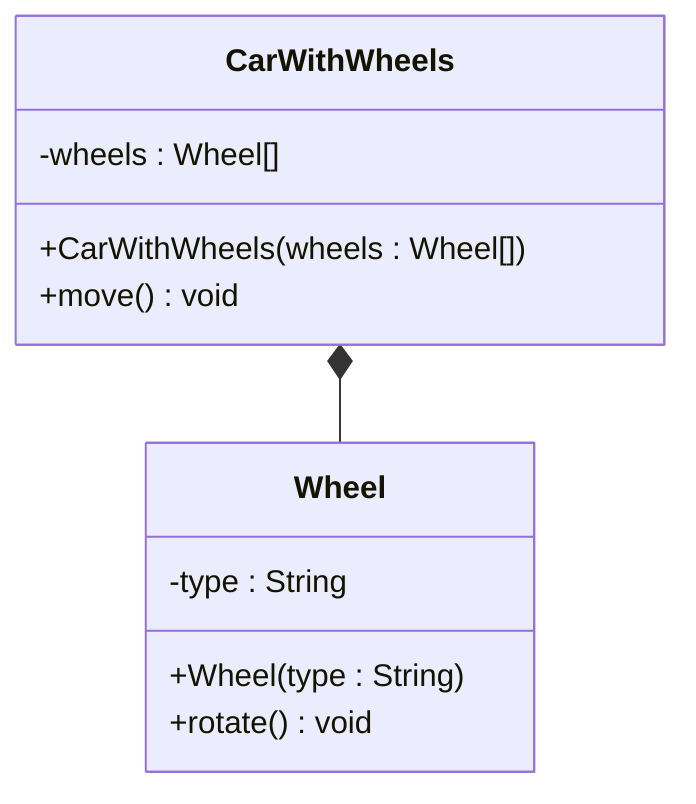
##### 10. **Composition: A "has-an" instance of B. B cannot exist without A.**

A class contains another class, and the contained class cannot exist independently.

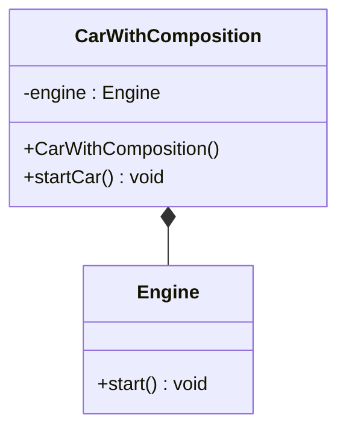
#### Driver Code
```java
public class Main {
    public static void main(String[] args) {
        // Generalization and Inheritance
        Car car = new Car();
        car.start();
        car.drive();

        ElectricCar electricCar = new ElectricCar();
        electricCar.start();
        electricCar.drive();
        electricCar.charge();

        // Use Interface
        Driver driver = new Driver(car);
        driver.operateVehicle();

        // Association
        Engine engine = new Engine();
        CarWithEngine carWithEngine = new CarWithEngine(engine);
        carWithEngine.startCar();

        // Uni-directional Association
        Radio radio = new Radio();
        CarWithRadio carWithRadio = new CarWithRadio(radio);
        carWithRadio.playCarMusic();

        // Aggregation
        Wheel[] wheels = {new Wheel("Front Left"), new Wheel("Front Right"), new Wheel("Rear Left"), new Wheel("Rear Right")};
        CarWithWheels carWithWheels = new CarWithWheels(wheels);
        carWithWheels.move();

        // Composition
        CarWithComposition carWithComposition = new CarWithComposition();
        carWithComposition.startCar();
    }
}
```
#### **7. Association (Bi-directional)**

In a **bi-directional Association**, both classes know about each other and can interact.
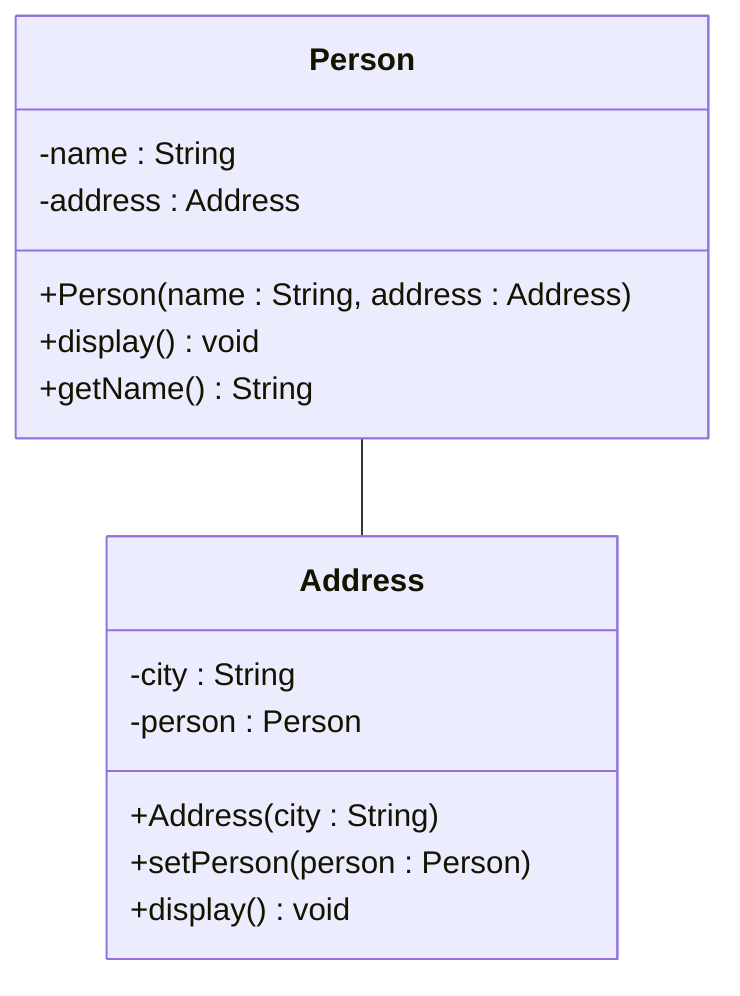
Here:
- `Person` has a reference to `Address`.
- `Address` also has a reference to `Person`.
- Both classes can call methods on each other.
#### **8. Uni-directional Association**

In **Uni-directional Association**, one class knows about the other, but the other class does not know about the first one. This is a one-way relationship.

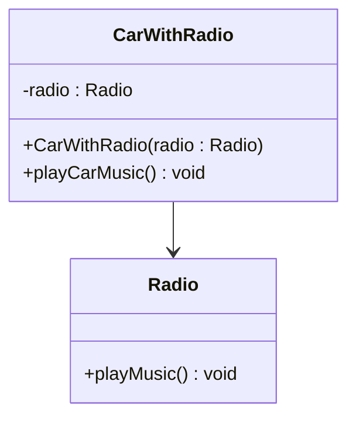
Here:
- `CarWithRadio` has a reference to `Radio`.
- `CarWithRadio` can call methods on `Radio`.
- `Radio` does not have a reference to `CarWithRadio`.
#### Updated Example to Show Both Relationships
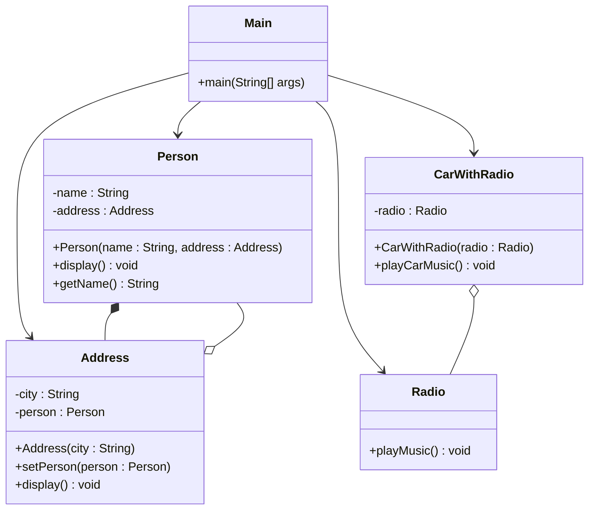
#### Output:

```java
Person: John
Address: New York
Person living here: John
Music is playing.
```
### **Designs Observed**
#### 1. Rewriting a primitive field to Class
```java
// primitive simplest Form
String name = "random";

// Extending Primitive to Simple class
public class User{
	String name;
}
```

#### 2. Rewriting primitive field to an Enum
```java
// if a field has only suitable values
// simplest form
String accountStatus = "Active" // "Active", "Pending", "Cancelled", "Deactived"

public Enum AccountStatus {
	ACTIVE,
	PENDING,
	CANCELLED,
	DEACTIVATED
} 
```

#### 2b. Rewriting a function to Class Method
```java
public boolean bookCheckout(Book book, User user){
	// implement logic
	return true;
}


// Move this func to class Block
class Functionalities {
	public boolean bookCheckout(Book book, User user){ // can be static method
		// implement logic
		return true;
	}
}
```
#### 3. Enhancing Class of primitives to a Class of Association
```java
public class User{
	String name;
	String Address
}

// Scaling class by adding a Association (Aggregation/Composition)
public class User {
	String name;
	Address address;
}
public class Address {
	String place;
	int pincode;
}
```

#### 4. Enhancing Class of primitives to Inherited Class of (Association/Primitives)
```java
// Extending Primitive to Simple class
public class User{
	String name;
}

// Scaling class by adding a Association (Aggregation/Composition)
public class Admin extends User {
	String id;
	Address address;
	// Add behaviours if needed.
}

public class Address {
	String place;
	int pincode;
}
```

#### 5. Enhancing Class fields using Encapsulation.
```java
// simplest form
public class User {
	int id;
	String name;
}

// After Encapsulation getters & setters
public class User {
	// 1. Fields are private
	- int id;
	- String name;

	// 2. Adding getters & setters (plain without logic)
	// 2a. for Ids
	+ int getId(){
		return this.id;	
	}
	+ void setId(int id){
		this.id = id;	
	}

	// 2b. for Names
	+ int getName(){
		return this.name;	
	}
	+ void setName(Name name){
		this.name = name;	
	}
}
```

#### 6. Removing a method outside the class
```java
public class Book {
	String id;
	String title;

	+ boolean checkOut(User user){
		//use this & User object to get checkout conditions
	}
}

//Removing boolean checkOut(User)

public class Book{
	String id;
	String title;
}

public class Operations{
	boolean checkOut(Book book, User user){
		//use Book & User instance 
	}
}
```