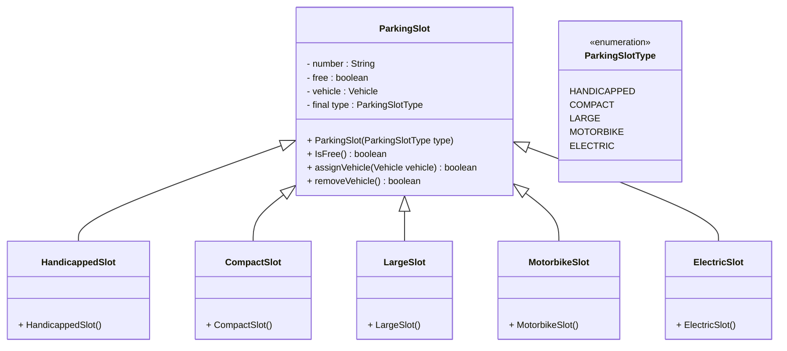
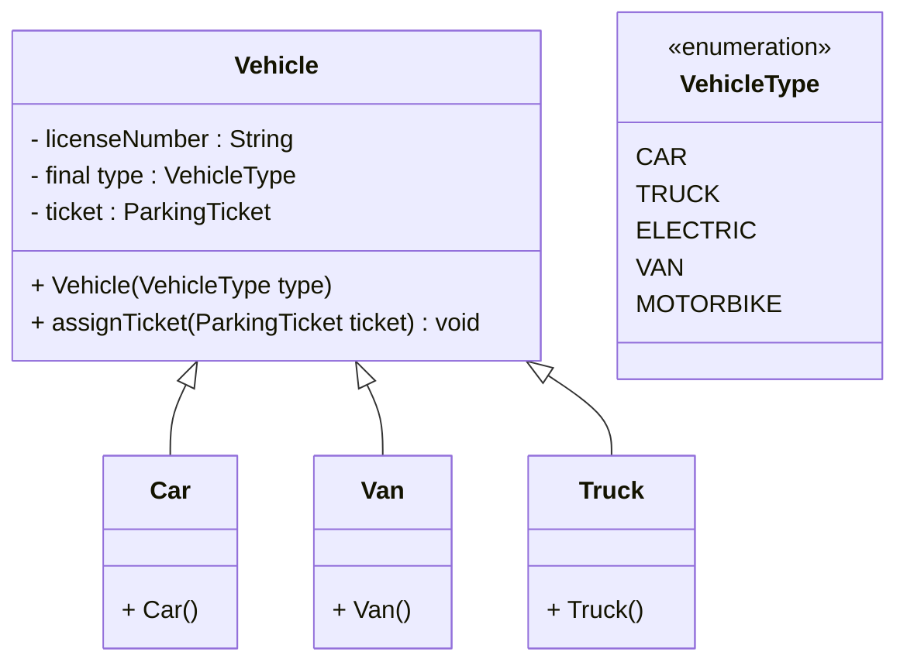
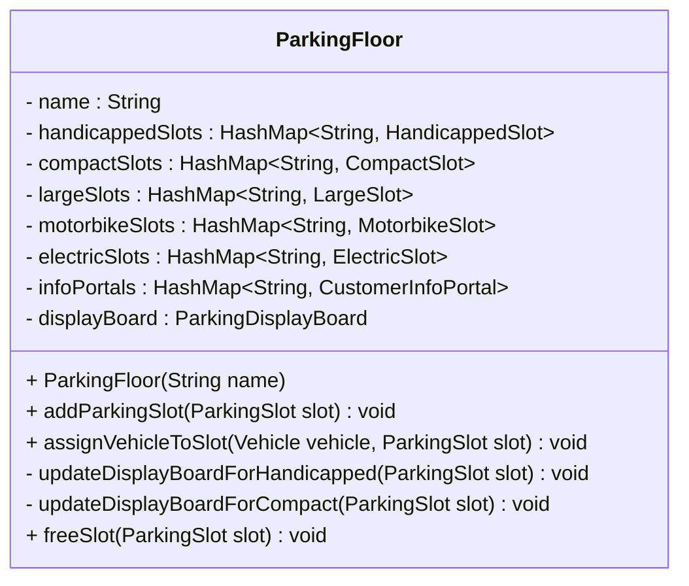
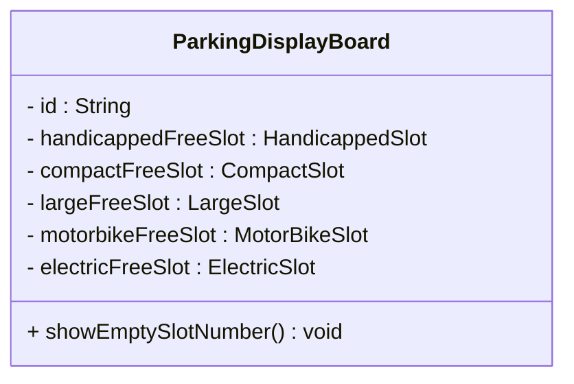
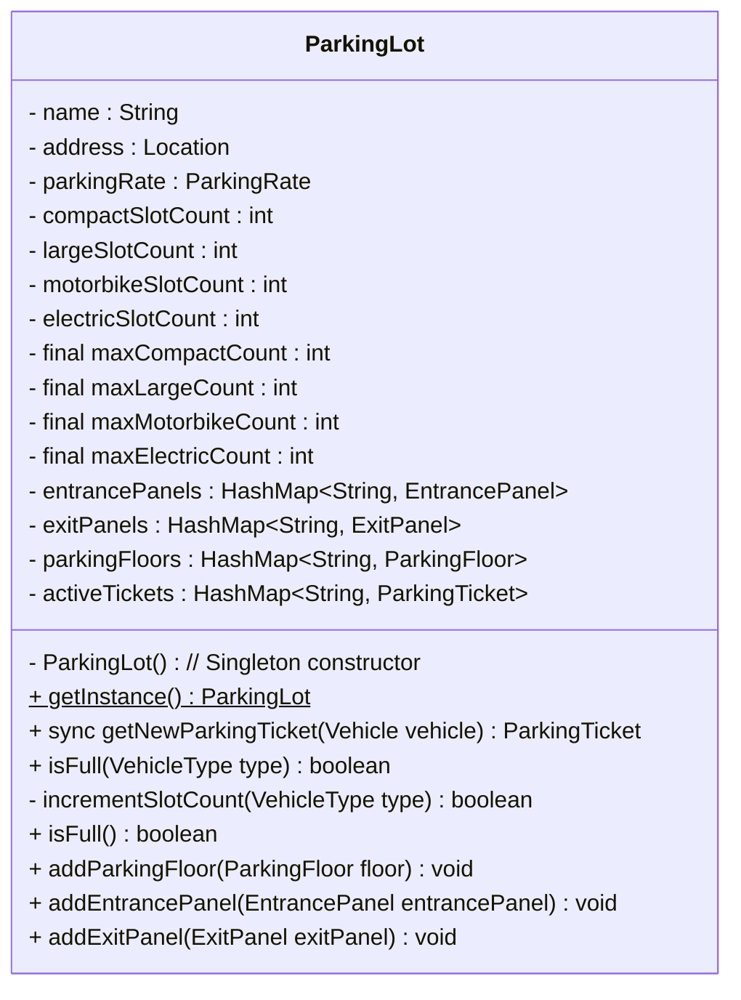
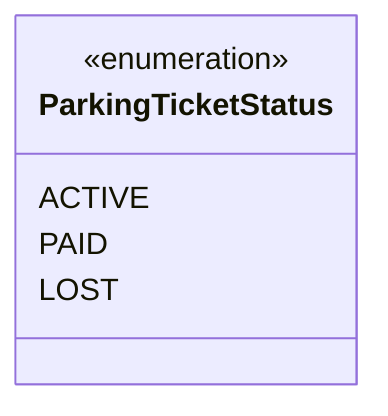
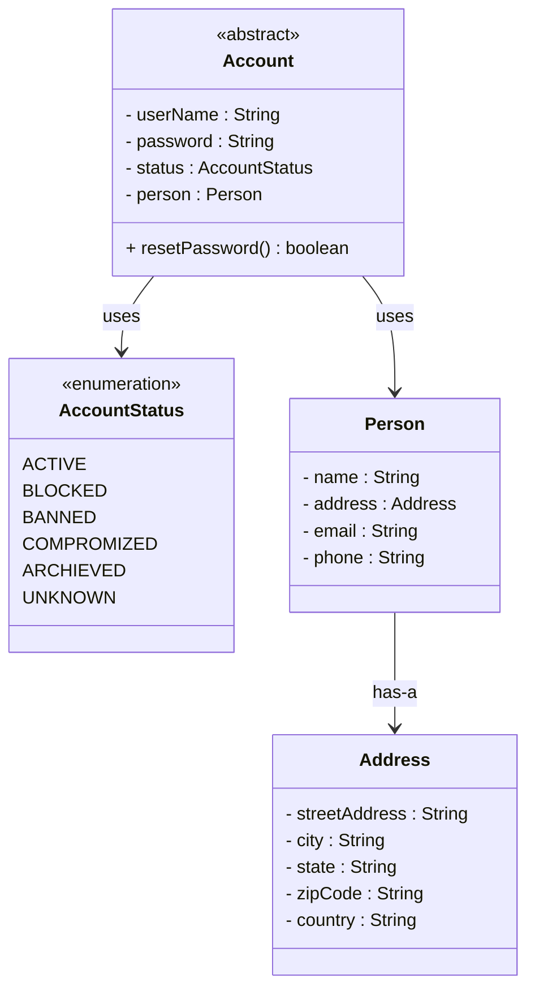
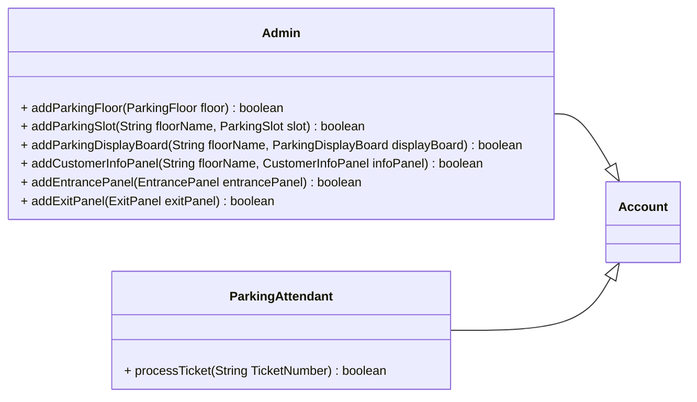

```java
// Step 1:
// Here is the definition of parking slot & all it's children classes
```



```java
// step1a:
// Here is the definition for vehicle and all of it's child classes
// ParkingSlot --> Vehicle
```



```java
// step2:
// ParkingFloor *-- ParkingSlot
```

```java
// step 3:
// ParkingFloor *-- ParkingDisplayBoard
```


```java
// step4:
// ParkingLot *-- ParkingFloor
```






```java
//For simplicity, we are not defining getter & setter functions. The reader can assume that all class attributes are private & accessed through their respective public getter method & modified through public setter.
```


```java
// Admin --|> Account 
// ParkingAttendant --|> Account 
```




