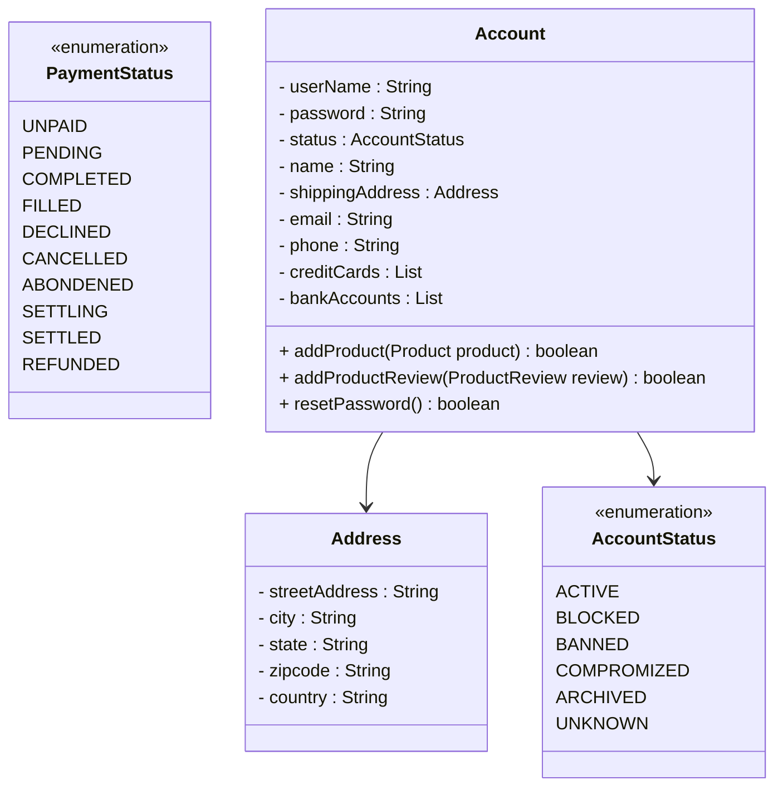
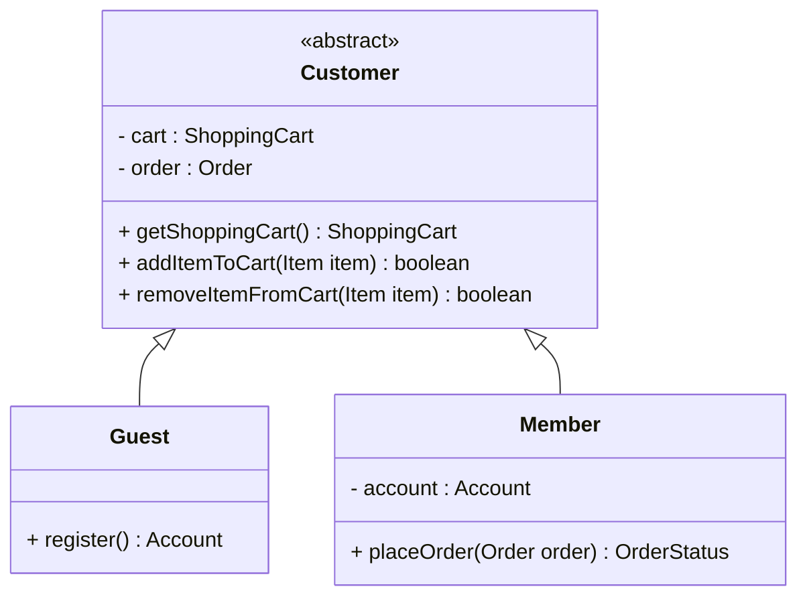
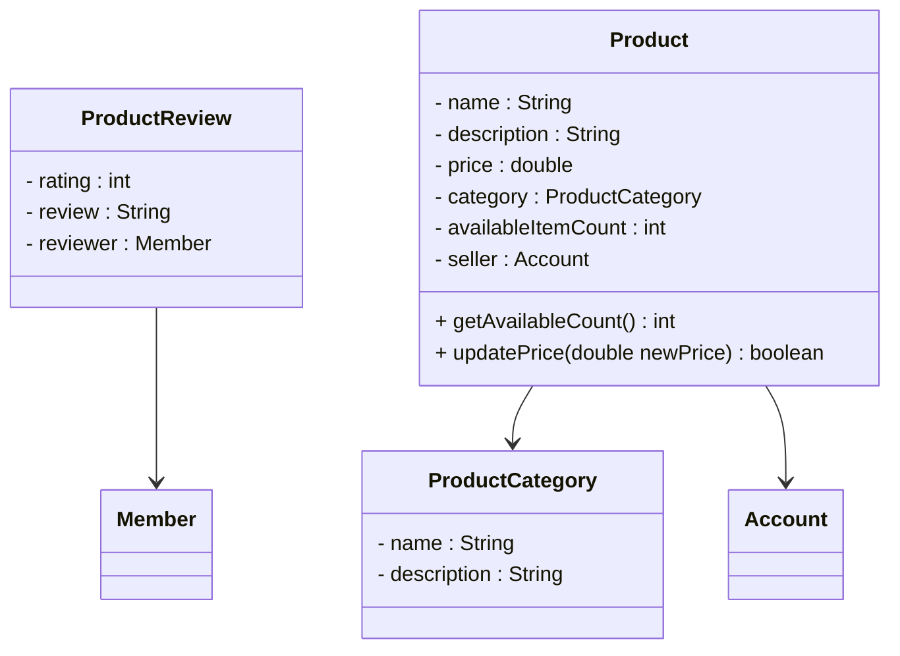
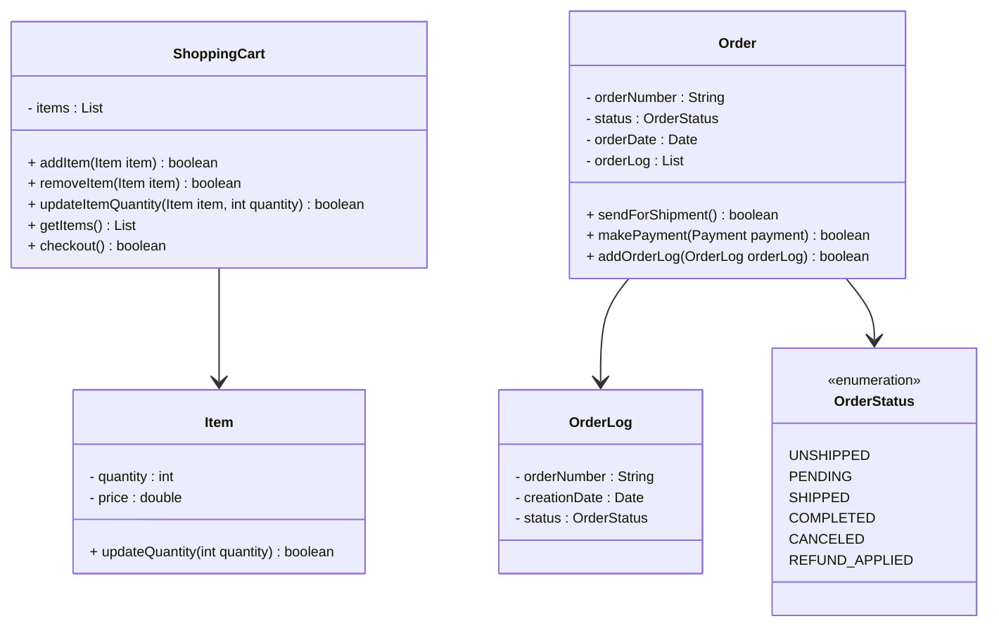
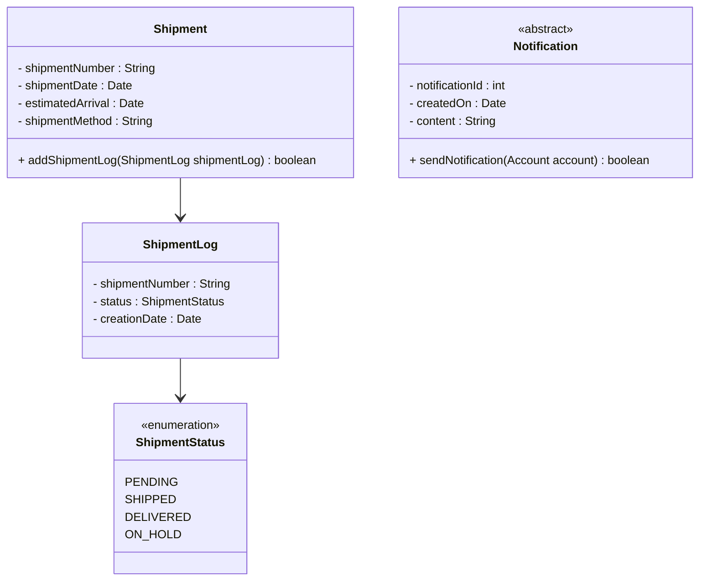
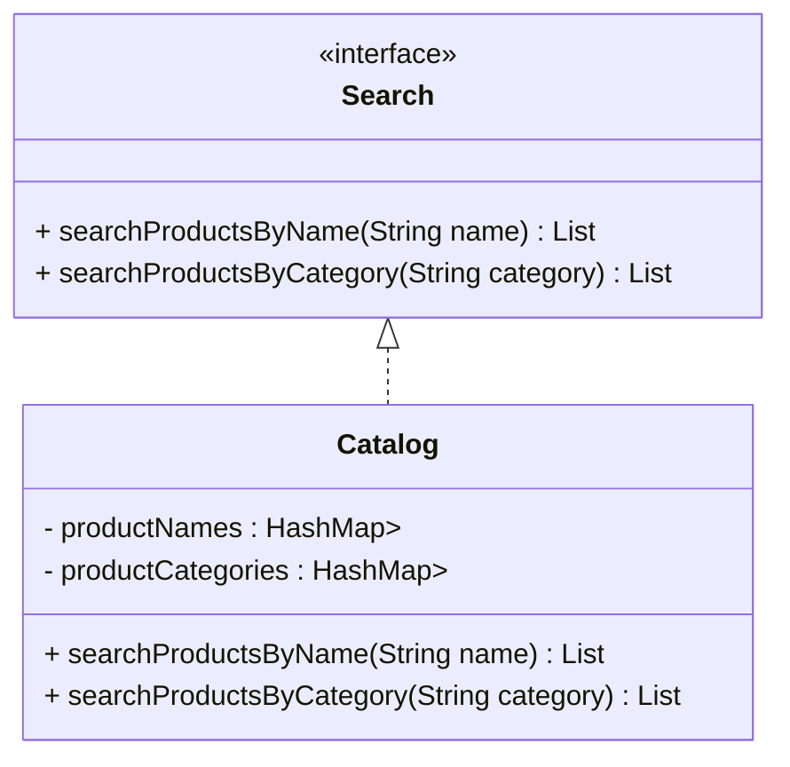

```java
// Account, Customer, Admin & Guest: These classes represent different people that interact with our system
```


```java
//ProductCategory, Product & Product Review: Here are the classes related to a product
```



```java
//ShoppingCart, Item, Order & OrderLog: Users will put items in shopping cart and place order to buy all items in the cart.
```



```java
//Shipment, ShipmentLog & Notification: After successfully placing an order, a shipment record will be created:
```



```java
// Search interface & Catalog: Catalog will implement Search to facilitate searching of products
```


