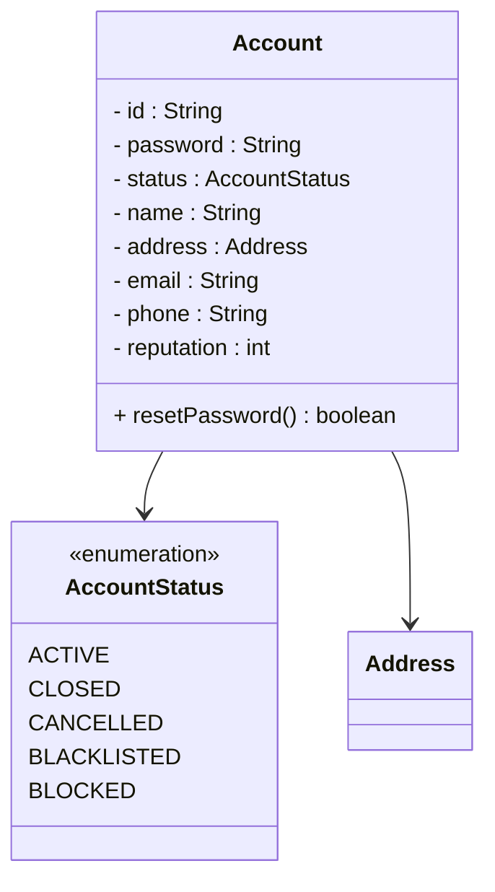
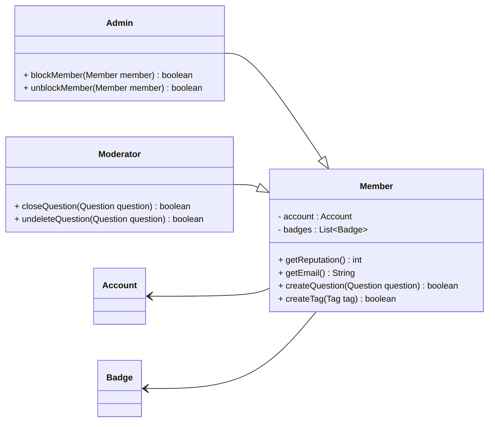
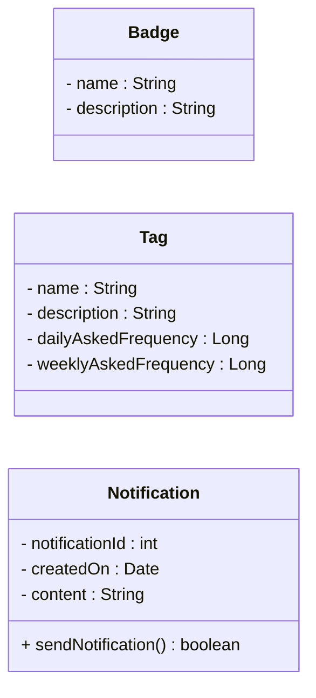
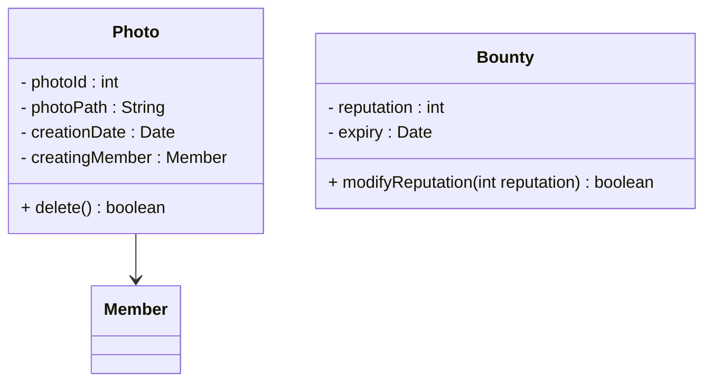
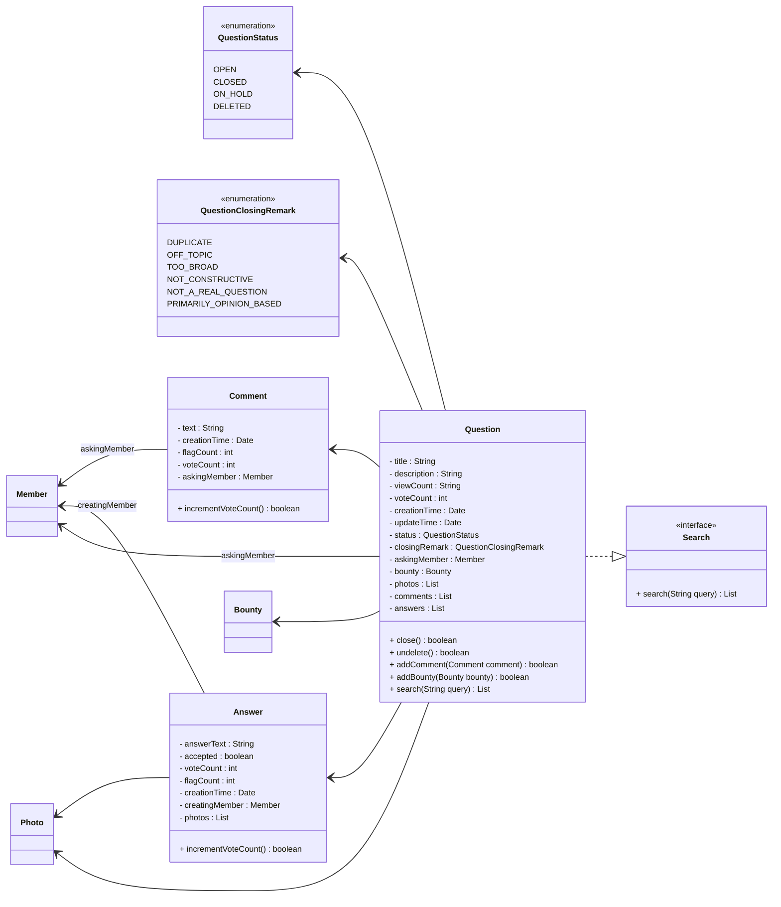

```java
// Account
```


```java
//Member, Admin & Moderator: These classes represent different people that interact with our system:
```



```java
// Badge, Tag & Notification: Members have badges, questions have tags & notifications:
```



```java
//Photo & Bounty: Members can put bounties on questions. Answers and Questions can have multiple photos
```



```java
// Question, Comment & Answer: Members can ask questions, as well as add an answer to any question. All members can add comments to all open questions or answers:
```

