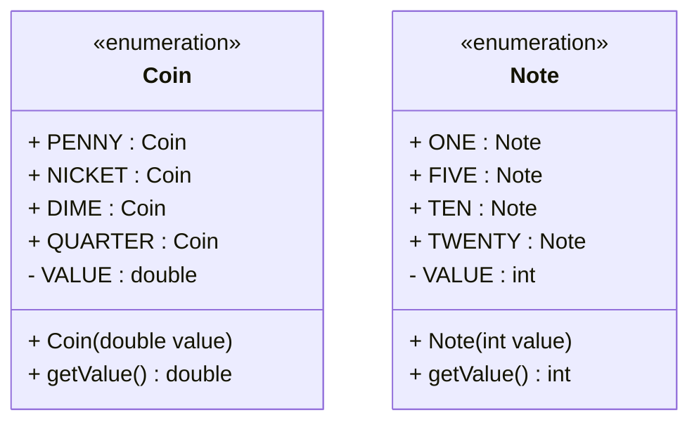
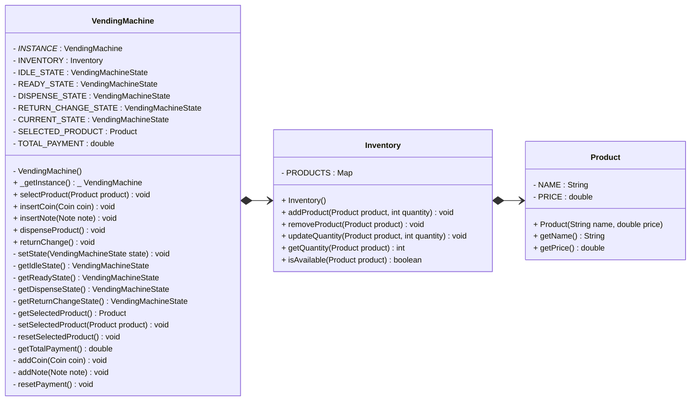
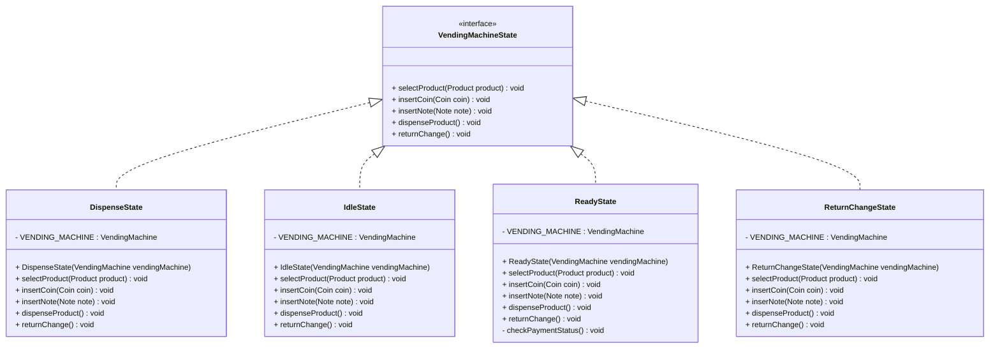

```java
// Dispense State
```




```java
public class VendingMachineDemo {
	public static void run() {
		VendingMachine vendingMachine = VendingMachine.getInstance();

		// Add products to inventory
		Product coke = new Product("Coke", 1.5);
		Product pepsi = new Product("Pepsi", 1.5);
		Product water = new Product("Water", 1.0);

		vendingMachine.inventory.addProduct(coke, 5);
		vendingMachine.inventory.addProduct(pepsi, 3);
		vendingMachine.inventory.addProduct(water, 2);

		// Select a product
		vendingMachine.selectProduct(coke);

		// Insert coins
		vendingMachine.insertCoin(Coin.QUARTER);
		vendingMachine.insertCoin(Coin.QUARTER);
		vendingMachine.insertCoin(Coin.QUARTER);
		vendingMachine.insertCoin(Coin.QUARTER);

		// Insert a note
		vendingMachine.insertNote(Note.FIVE);

		// Dispense the product
		vendingMachine.dispenseProduct();

		// Return change
		vendingMachine.returnChange();

		// Select another product
		vendingMachine.selectProduct(pepsi);

		// Insert insufficient payment
		vendingMachine.insertCoin(Coin.QUARTER);

		// Try to dispense the product
		vendingMachine.dispenseProduct();

		// Insert more coins
		vendingMachine.insertCoin(Coin.QUARTER);
		vendingMachine.insertCoin(Coin.QUARTER);
		vendingMachine.insertCoin(Coin.QUARTER);
		vendingMachine.insertCoin(Coin.QUARTER);

		// Dispense the product
		vendingMachine.dispenseProduct();

		// Return change
		vendingMachine.returnChange();
		
	}
}
```