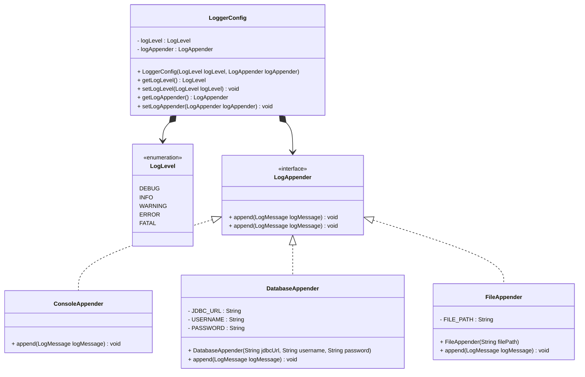
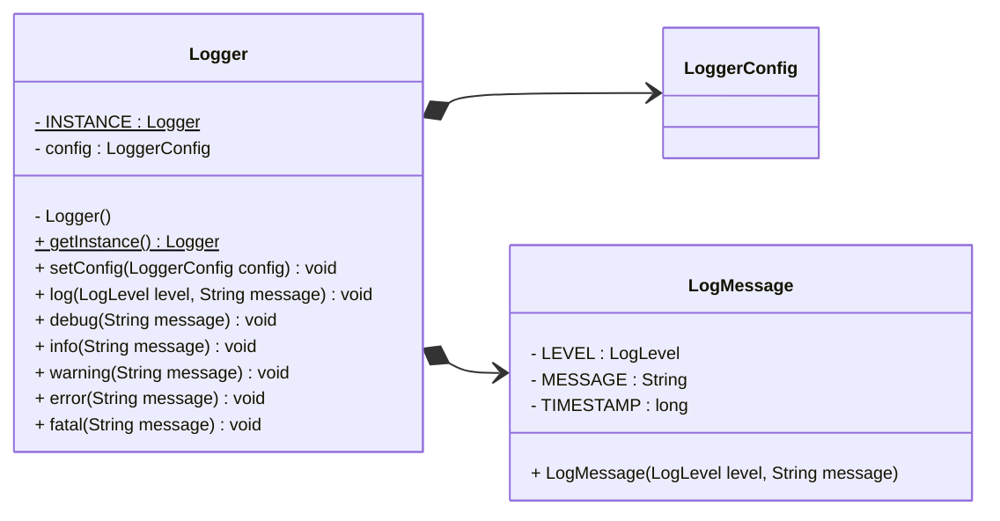

Client Code

```java
public class LoggingFrameworkDemo {
	public static void run(){
		Logger logger = Logger.getInstance();

		// Logging with default configuration
		logger.info("This is an information message");
		logger.warning("This is a warning message");
		logger.error("This is an error message");

		// Changing log level & appender
		LoggerConfig config = new LoggerConfig(LogLevel.DEBUG, new FileAppender("app.log"));
		logger.setConfig(config);

		logger.debug("This is a debug message");
		logger.info("This is an information message");
	}
}
```