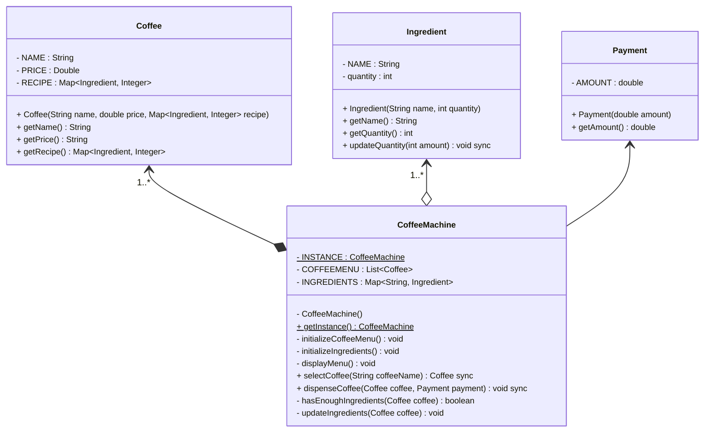

```mermaid
%%{init: {'themeVariables': {'fontSize': '10px'}}}%%
classDiagram
	direction BT
    class Coffee {
        - NAME : String
        - PRICE : Double
        - RECIPE : Map~Ingredient, Integer~
        + Coffee(String name, double price, Map~Ingredient, Integer~ recipe)
        + getName() String
        + getPrice() String
        + getRecipe() Map~Ingredient, Integer~
    }

    class CoffeeMachine {
        - INSTANCE : CoffeeMachine$
        - COFFEEMENU : List~Coffee~
        - INGREDIENTS : Map~String, Ingredient~

        - CoffeeMachine()
        + getInstance() CoffeeMachine$
        - initializeCoffeeMenu() void
        - initializeIngredients() void
        - displayMenu() void
        + selectCoffee(String coffeeName) Coffee sync
        + dispenseCoffee(Coffee coffee, Payment payment) void sync
        - hasEnoughIngredients(Coffee coffee) boolean
        - updateIngredients(Coffee coffee) void
    }

    class Ingredient {
        - NAME : String
        - quantity : int
        + Ingredient(String name, int quantity)
        + getName() String
        + getQuantity() int
        + updateQuantity(int amount) void sync
    }

    class Payment {
        - AMOUNT : double
        + Payment(double amount)
        + getAmount() double 
    }

    CoffeeMachine *--> "1..*" Coffee
    CoffeeMachine o--> "1..*" Ingredient
    CoffeeMachine --> Payment
```


```java
//CoffeeVendingMachineDemo.java
/*
Coffee.java
CoffeeMachine.java
Ingredient.java
Payment.java
*/
```
