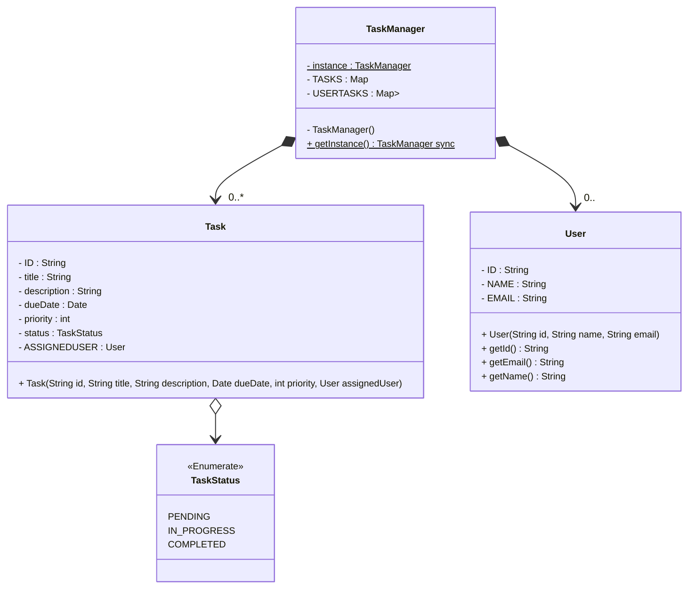

```java
public class TaskManagementSystemDemo {
	public static void run(){
		TaskManager taskManager = TaskManager.getInstance()

		// Create users
		User user1 = new User("1", "John Doe", "john@example.com");
		User user2 = new User("2", "Jane Smith", "jane@example.com");

		// Create tasks
		Task task1 = new Task("1", "Task1", "Description 1", new Date(), 1, user1);
		Task task2 = new Task("2", "Task2", "Description 2", new Date(), 2, user2);
		Task task3 = new Task("3", "Task3", "Description 3", new Date(), 1, user1);

		// Add tasks to the taskManager
		taskManager.createTask(task1);
		taskManager.createTask(task2);
		taskManager.createTask(task3);

		// Update a task
		task2.setDescription("Update description");
		taskManager.updateTask(task2);

		// Search tasks
		List<Task> searchResults = taskManager.searchTasks("Task");
		println("Search Results:");
		for(Task task : searchResults){
			println("task.getTitle()");
		}


		// Filter tasks
		List<Task> filteredTasks = taskManager.filterTasks(TaskStatus.PENDING, new Date(0), new Date(), 1);
		println("Filtered Tasks");
		for(Task task : filteredTasks){
			println(task.getTitle());
		}

		// Mark a task as completed
		taskManager.markTaskAsCompleted("1");

		// Get task history for a user
		List<Task> taskHistory = taskManager.getTaskHistory(user1);
		println("Task History for " + user1.getName() + ":");
		for(Task task : taskHistory){
			println(task.getTitle());
		}

		// Delete a task
		taskManager.deleteTask("3");
	}
}
```

#### Code
```java
public class Task {
	private final String id;
	private String title;
	private String description;
	private Date dueDate;
	private int priority;
	private TaskStatus status;
	private final User assignedUser;

	public Task(String id, String title, String description, Date dueDate, int priority, User assignedUser) {
		this.id = id;
		this.title = title;
		this.description = description;
		this.dueDate = dueDate;
		this.priority = priority;
		this.status = TaskStatus.PENDING;
		this.assignedUser = assignedUser;
	}

	// Getter & Setter
	/*
	getId(), getTitle(), getDescription(), getDueDate(), getPriority(), getStatus(), getAssignedUser()
	setTitle(), setDescription(), setDueDate(), setPriority(), setStatus()
	*/  
}
```

```java
public class TaskManager {
	private static TaskManager instance;
	private final Map<String, Task> tasks;
	private final Map<String, List<Task>> userTasks;

	private TaskManager(){
		tasks = new ConcurrentHashMap<>();
		userTasks = new ConcurrentHashMap<>();
	}

	public static synchronized TaskManager getInstance(){
		if(instance == null){
			instance = new TaskManager();
		}
		return instance;
	}

	public void createTask(Task task){
		tasks.put(task.getId(), task);
		assignTaskToUser(task.getAssignedUser(), task);
	}

	public void updateTask(Task updatedTask){
		Task existingTask = tasks.get(updatedTask.getId());
		if(existingTask != null){
			synchronized (existingTask){
				// can be done using modelMapper class
				existingTask.setTitle(updatedTask.getTitle());
				existingTask.setDescription(updatedTask.getDescription());
				existingTask.setDueDate(updatedTask.getDueDate());
				existingTask.setPriority(updatedTask.getPriority());
				existingTask.setStatus(updatedTask.getStatus());

				User previousUser = existingTask.getAssignedUser();
				User newUser = updatedTask.getAssignedUser();

				if(!previousUser.equals(newUser)){
					unassignTaskFromUser(previousUser, existingTask);
					assignTaskToUser(newUser, existingTask);
				}
			}
		}
	}

	public void deleteTask(String taskId){
		Task task = task.remove(taskId);
		if(task != null){
			unassignTaskFromUser(task.getAssignedUser(), task);
		}
	}

	public List<Task> searchTasks(String keyword){
		List<Task> matchingTasks = new ArrayList<>();
		for(Task task : tasks.values()){
			if (task.getTitle().contains(keyword) || 
				task.getDescription().contains(keyword) ){
				matchingTasks.add(task);
			}
		}
		return matchingTasks;
	}

	public List<Task> filterTasks(TaskStatus status, Date startDate, Date endDate, int priority){
		List<Task> filteredTasks = new ArrayList<>();
		
		// can also rewrite using streams
		for(Task task: tasks.values()){
			if(task.getStatus() == status &&
				task.getDueDate().compareTo(startDate) >= 0 &&
				task.getDueDate().compareTo(endDate) <= 0 &&
				task.getPriority() == priority){
			
				filteredTasks.add(task)
			}
		}
	}

	public void markTaskAsCompleted(String taskId){
		Task task = tasks.get(taskId);
		if(task != null){
			synchronized (task) {
				task.setStatus(TaskStatus.COMPLETED);
			}
		}
	}

	public List<Task> getTaskHistory(User user){
		return new ArrayList<>(userTasks.getOrDefault(user.getId(), new ArrayList<>()));
	}

	private void assignTaskToUser(User user, Task task){
		userTasks.computeIfAbsent(user.getId(), k -> new CopyOnWriteArrayList<>()).add(task);
	}

	private void unassignTaskFromUser(User user, Task task){
		List<Task> tasks = userTasks.get(user.getId());
		if(tasks != null){
			tasks.remove(task);
		}
	}
}
```