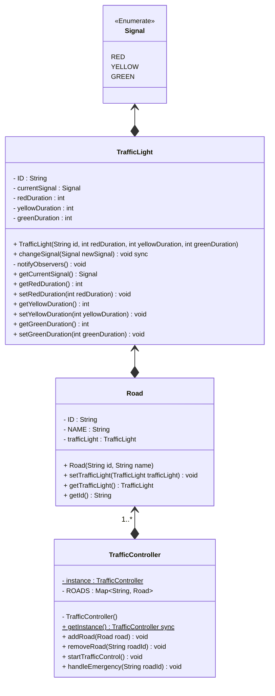

```java
public class TrafficSignalSystemDemo {
	public static void run() {
		TrafficController trafficCont = TrafficController.getInstance();

		// Create roads
		Road road1 = new Road("R1", "Main Street");
		Road road2 = new Road("R2", "Broadway");
		Road road3 = new Road("R3", "Park Avenue");
		Road road4 = new Road("R4", "Elm Street");

		// Create traffic lights
		TrafficLight tfLt1 = new TrafficLight("TL1", 6000, 3000, 9000);
		TrafficLight tfLt2 = new TrafficLight("TL2", 6000, 3000, 9000);
		TrafficLight tfLt3 = new TrafficLight("TL3", 6000, 3000, 9000);
		TrafficLight tfLt4 = new TrafficLight("TL4", 6000, 3000, 9000);

		// Assign traffic lights to roads
		road1.setTrafficLight(tfLt1);
		road2.setTrafficLight(tfLt2);
		road3.setTrafficLight(tfLt3);
		road4.setTrafficLight(tfLt4);

		// Add roads to the traffic controller
		trafficCont.addRoad(road1);
		trafficCont.addRoad(road2);
		trafficCont.addRoad(road3);
		trafficCont.addRoad(road4);

		// Start traffic control
		trafficController.startTrafficControl();

		// Simulate an emergency on a specific road
		trafficController.handleEmergency("R2");
	}
}
```