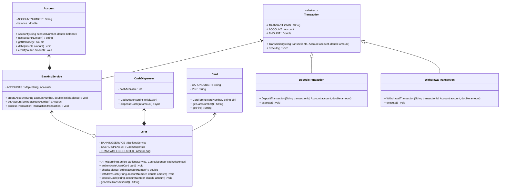

```java
public class ATMDemo {
	public static void run() {
		BankingService bankingService = new BankingService();
		CashDispenser cashDispenser = new CashDispenser(10000);
		ATM atm = new ATM(bankingService, cashDispenser);

		// Create sample accounts
		bankingService.createAccount("1234567890", 1000.0);
		bankingService.createAccount("9876543210", 500.0);

		// Perform ATM operations
		Card card = new Card("1234567890", "1234");
		atm.authenticateUser(card);

		double balance = atm.checkBalance("1234567890");
		println("Account balance: "+ balance);


		atm.withdrawCash("1234567890", 500.0);
		atm.depositCash("9876543210", 200.0);

		balance = atm.checkBalance("1234567890");
		println("Updated account balance: " + balance);
	}
}
```
