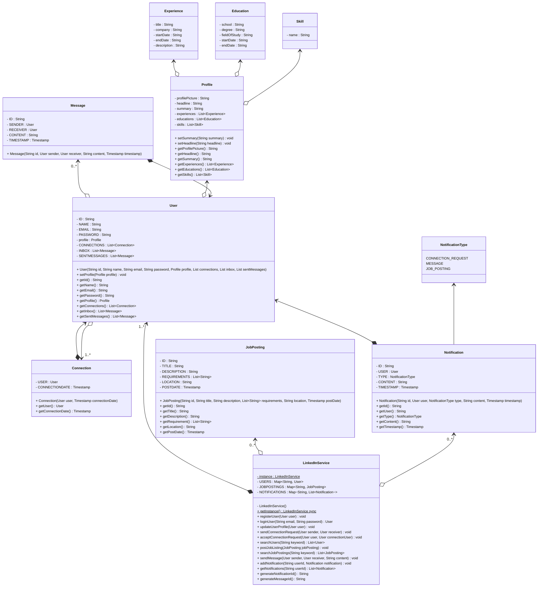

```java
public class LinkedInDemo {
	public static void run() {
		LinkedInService linkedInSrvc = LinkedInService.getInstance();

		// User registration
		User user1 = new User("1", "John Doe", "john@example.com", "password", new Profile(), new ArrayList<>(), new ArrayList<>(), new ArrayList<>());
		User user2 = new User("2", "Jane Smith", "jane@example.com", "password", new Profile(), new ArrayList<>(), new ArrayList<>(), new ArrayList<>());
		linkedInSrvc.registerUser(user1);
		linkedInSrvc.registerUser(user2);

		// User login
		User loggedInUser = linkedInSrvc.loginUser("john@example.com", "password");
		if (loggedInUser != null){
			println("User Logged in: " + loggedInUser.getName());
		} else {
			println("Invalid email or password")
		}

		// Update user profile
		Profile profile = new Profile();
		profile.setHeadline("Software Engineer");
		profile.setSummary("Passionate about coding & problem-solving");
		loggedInUser.setProfile(profile);
		linkedInSrvc.updateUserProfile(loggedInUser);

		// Send connection request
		linkedInSrvc.sendConnectionRequest(user1, user2);

		// Accept connection request
		linkedInSrvc.acceptConnectionRequest(user2, user1);

		// Post a job listing
		JobPosting jobPosting = new JobPosting("1", "Software Developer", "We are hiring!", Arrays.asList("Java", "Python"), "San Francisco", new Timestamp( System.currentTimeMillis() ));
		linkedInSrvc.postJobListing(jobPosting);

		// Search for users
		List<User> searchResults = linkedInSrvc.searchUsers("John");
		println("Search Results:");
		for(User user : searchResults){
			println("Name: " + user.getName());
			println("Headline: "+ user.getProfile().getHeadline());
			println();
		}

		// Search for job postings
		List<JobPosting> jobPostingResults = linkedInSrvc.searchJobPosting("Software");
		println("Job Posting Results:");
		for(JobPosting posting : jobPostingResults){
			println("Title: " + posting.getTitle());
			println("Description: " + posting.getDescription());
			println();
		}

		// Send a message
		linkedInSrvc.sendMessage(user1, user2, "Hi Jane, hope you're doing well!");

		// Get notifications
		List<Notification> notifications = linkedInSrvc.getNotifications(user2.getId());
		println("Notifications :");
		for(Notification notification : notifications){
			println("Type: " + notification.getType());
			println("Content: "+ notification.getContent());
			println();
		}
	}
}
```