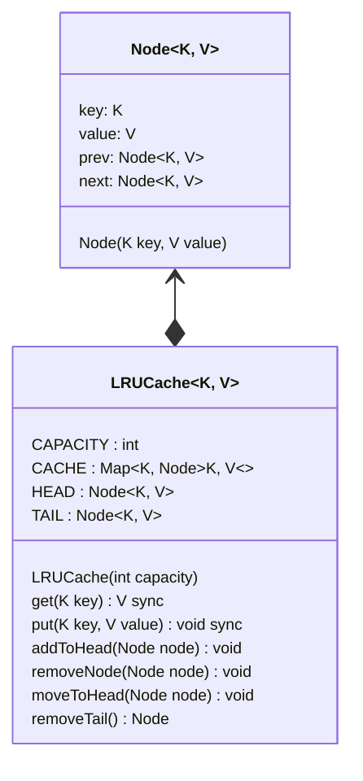

```java
public class LRUCacheDemo {
	public static void run(){
		LRUCache<Integer, String> cache = new LRUCache<>(3);

		cache.put(1, "Value 1");
		cache.put(2, "Value 2");
		cache.put(3, "Value 3");

		println(cache.get(1));  // output: value 1
		println(cache.get(2));  // output: value 2

		cache.put(4, "Value 4");

		println(cache.get(3)); // output: null
		println(cache.get(4)); // output: value 4

		cache.put(2, "Updated Value 2");

		println(cache.get(1)); // output: value 1
		println(cache.get(2)); // output: Updated value 2
	}
}
```
