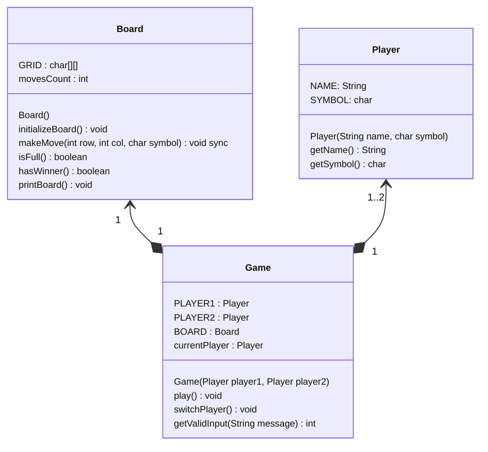

```java
public class TicTacToeDemo {
	public static void run() {
		Player player1 = new Player("Player 1", 'X');
		Player player2 = new Player("Player 2", 'O');

		Game game = new Game(player1, player2);
		game.play();
	}
}
```