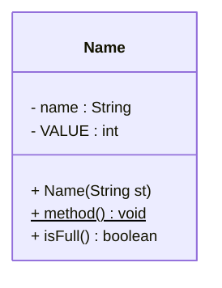
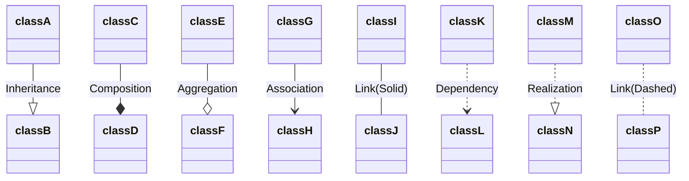

Prompt: Assume you are pro in java & Mermaid class UML diagrams. Below is the sample java code converted to mermaid code with few conventions followed.
1. field names should like field_name : datatype
2. If field is final, the variable name should be represented in upper case : datatype
3. For a methods it follows below representation method_name() returnType 
4. For static methods method_name() returnType should start & end with _ 
 
```java
public class Name {
	private String name;
	private final int value;

	public Name(String st){}
	public static void method(){}
	public boolean isFull(){
		return false;
	}
}
```




##### Relation

##### ReadMe
```
1. convert the code to mermaid diagram
2. Upload the mermaid diagrams & customize them in .drawio
3. Save the .drawio files for future reference
```